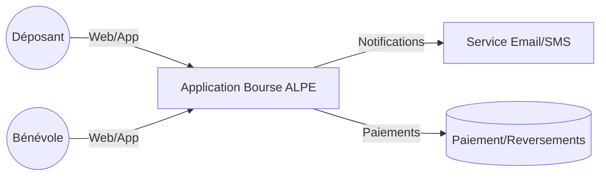

# Contexte (C4 niveau Contexte — ébauche)

# Contraintes & hypothèses

- Stack et hébergement à décider (voir ADRs). Priorité: simplicité et robustesse.
- Mode offline éventuel côté caisse à évaluer.

# Risques (exemples)

- Pics de charge pendant la bourse (encaissement simultané).
- Qualité réseau variable sur site.
- Cohérence inventaire et anti‑doublon étiquettes.

