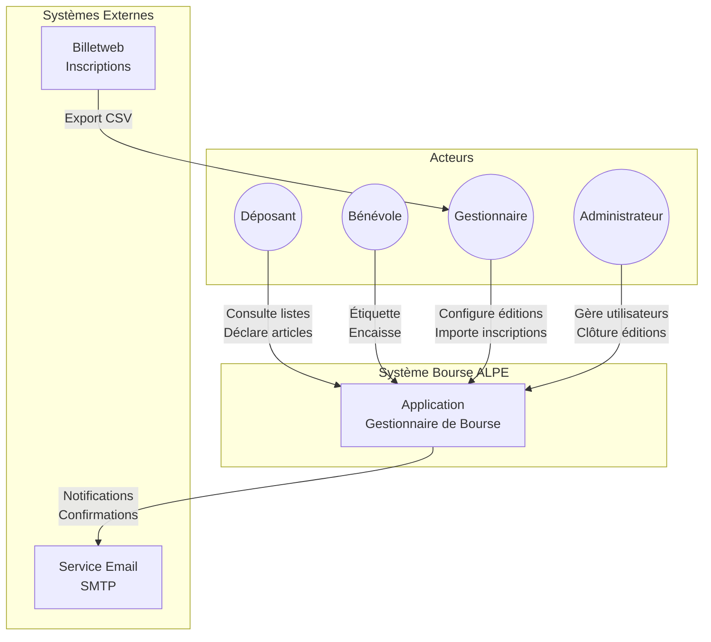
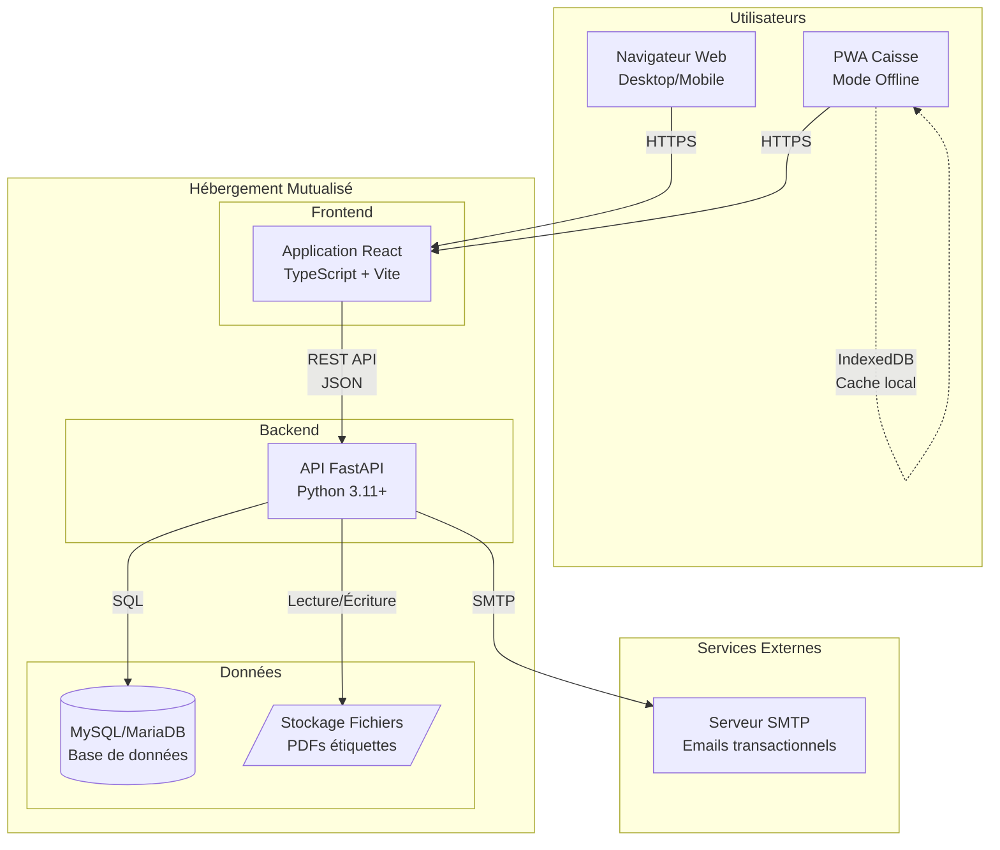
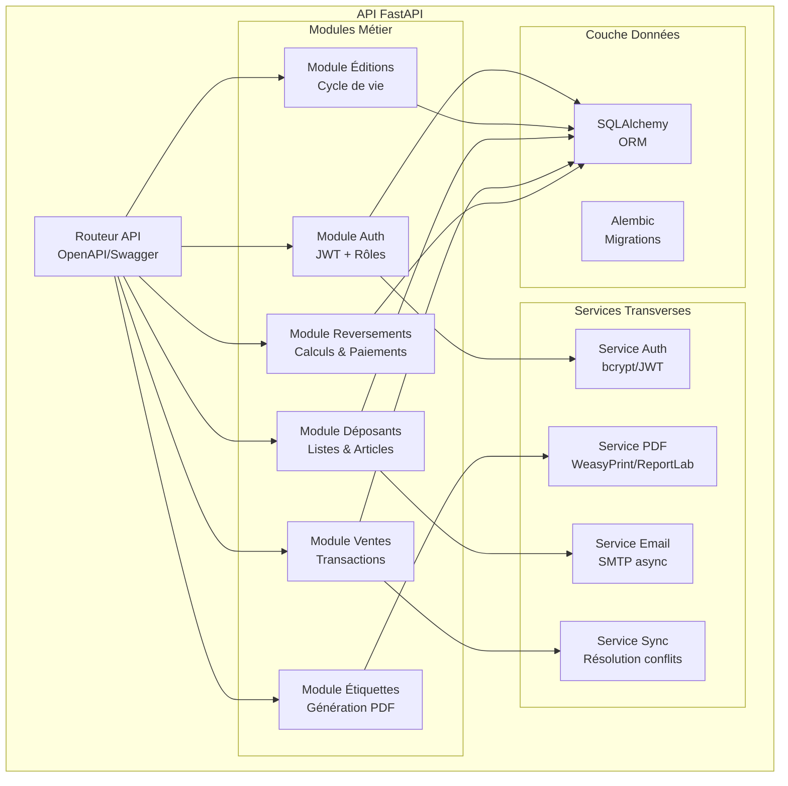
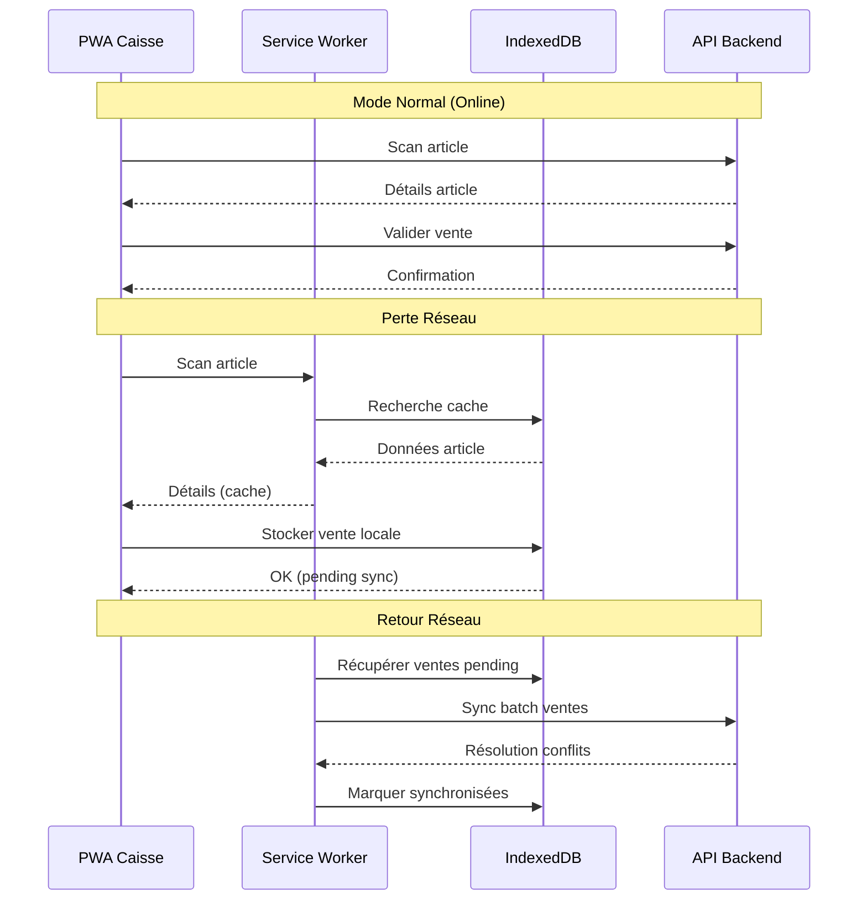
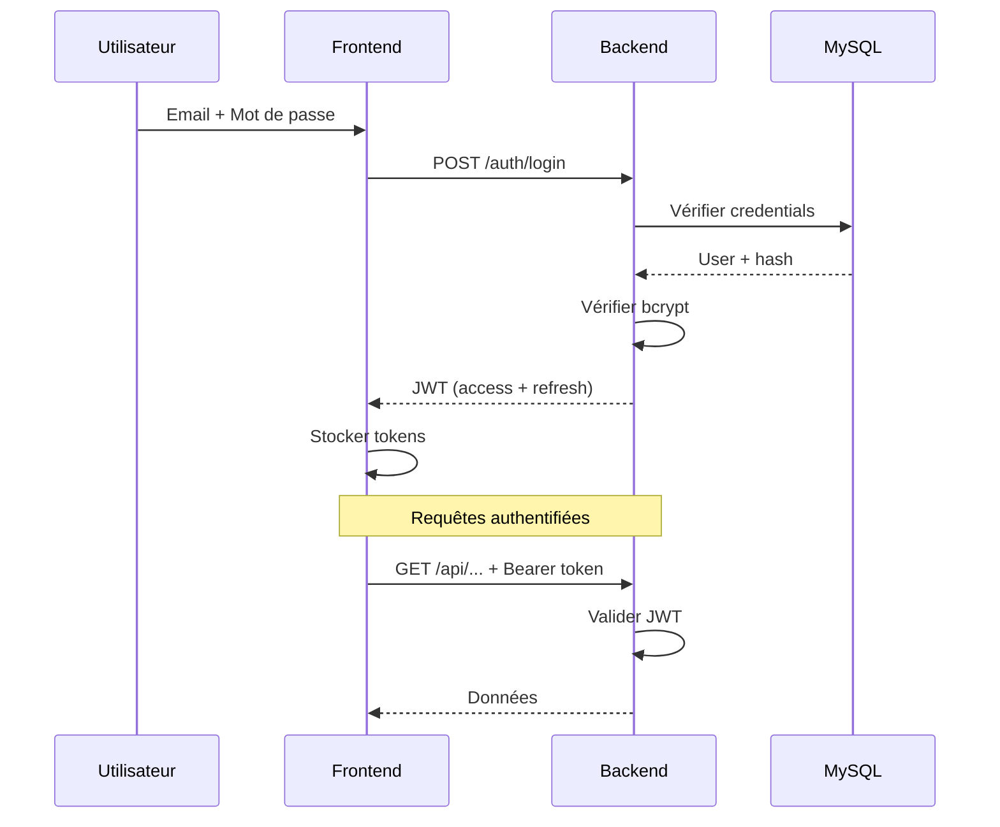
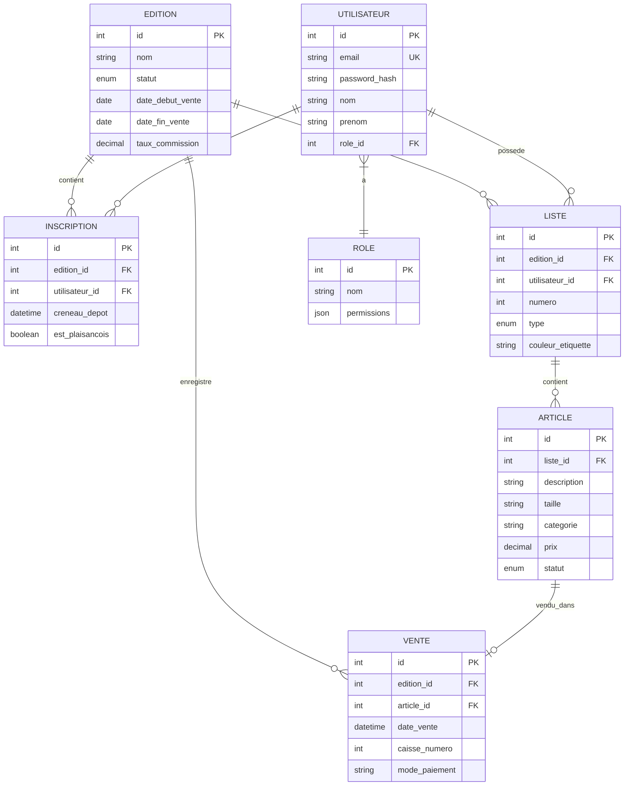

# 1. Vue d'ensemble

Ce document décrit l'architecture technique de l'application **Gestionnaire de Bourse ALPE**, une solution web permettant de gérer les bourses aux vêtements et jouets organisées par l'association ALPE Plaisance du Touch.

## 1.1 Objectifs architecturaux

| Objectif | Description |
|---|---|
| **Simplicité** | Stack accessible, maintenance aisée par une équipe bénévole |
| **Robustesse** | Fonctionnement fiable pendant les pics de vente (200+ transactions/heure) |
| **Économie** | Hébergement mutualisé à faible coût |
| **Offline** | Mode dégradé pour les caisses en cas de perte réseau |

## 1.2 Contraintes

- Budget limité (association à but non lucratif)
- Équipe technique bénévole et variable
- Utilisation ponctuelle mais intensive (2 bourses/an sur 3 jours)
- Réseau WiFi potentiellement instable sur le lieu de la bourse

---

# 2. Diagrammes C4

## 2.1 Niveau 1 : Contexte

Vue d'ensemble du système et de ses interactions avec les acteurs externes.

## 2.2 Niveau 2 : Conteneurs

Décomposition technique du système en conteneurs déployables.

## 2.3 Niveau 3 : Composants

Architecture interne de l'API Backend.

---

# 3. Stack Technique

## 3.1 Frontend

| Composant | Technologie | Justification |
|---|---|---|
| Framework | React 18+ | Écosystème mature, composants réutilisables |
| Langage | TypeScript | Typage statique, meilleure maintenabilité |
| Build | Vite | Build rapide, configuration simple |
| State | React Query + Context | Gestion cache API + état local |
| UI | Tailwind CSS | Utilitaire, responsive, bundle optimisé |
| PWA | Workbox | Service Worker pour mode offline |
| QR/Barcode | html5-qrcode | Scan caméra tablette/smartphone |

## 3.2 Backend

| Composant | Technologie | Justification |
|---|---|---|
| Framework | FastAPI | Async natif, documentation OpenAPI auto |
| Langage | Python 3.11+ | Lisible, large écosystème, hébergement mutualisé |
| ORM | SQLAlchemy 2.0 | ORM mature, support async |
| Migrations | Alembic | Gestion versions schéma DB |
| Auth | python-jose + passlib | JWT + bcrypt |
| PDF | WeasyPrint ou ReportLab | Génération étiquettes |
| Email | aiosmtplib | Envoi async emails |
| Validation | Pydantic | Validation données entrantes |

## 3.3 Base de données

| Composant | Technologie | Justification |
|---|---|---|
| SGBD | MySQL 8.0 / MariaDB 10.6+ | Disponible hébergement mutualisé |
| Charset | utf8mb4 | Support complet Unicode/émojis |
| Collation | utf8mb4_unicode_ci | Tri insensible à la casse |

## 3.4 Infrastructure

| Composant | Solution | Justification |
|---|---|---|
| Hébergement | Mutualisé (OVH, o2switch, etc.) | Coût ~50-100€/an |
| Déploiement | FTP/SSH + scripts | Compatible hébergement mutualisé |
| SSL | Let's Encrypt (via hébergeur) | HTTPS gratuit |
| Backup | Automatique hébergeur + export manuel | Sécurité données |

---

# 4. Mode Offline (Caisses)

## 4.1 Stratégie

Le mode offline est un **fallback** en cas de perte réseau, pas le mode principal.

## 4.2 Données cachées localement

| Données | Stratégie cache | Durée |
|---|---|---|
| Catalogue articles (édition en cours) | Pre-fetch au login | Session |
| Liste des prix | Pre-fetch | Session |
| Ventes en attente | Stockage IndexedDB | Jusqu'à sync |
| Assets statiques | Service Worker | Long terme |

## 4.3 Résolution de conflits

- **Ventes concurrentes sur même article** : Premier arrivé, premier servi (timestamp serveur)
- **Article vendu offline puis online** : Alerte gestionnaire pour résolution manuelle
- **Limite** : Maximum 50 ventes offline par caisse avant sync obligatoire

---

# 5. Sécurité

## 5.1 Authentification

## 5.2 Tokens JWT

| Token | Durée | Usage |
|---|---|---|
| Access Token | 15 minutes | Authentification API |
| Refresh Token | 7 jours | Renouvellement access token |

## 5.3 Rôles et permissions

| Ressource | Déposant | Bénévole | Gestionnaire | Admin |
|---|:---:|:---:|:---:|:---:|
| Voir ses propres listes | ✅ | ✅ | ✅ | ✅ |
| Modifier ses articles | ✅ | ❌ | ❌ | ❌ |
| Scanner/encaisser | ❌ | ✅ | ✅ | ✅ |
| Annuler une vente | ❌ | ❌ | ✅ | ✅ |
| Configurer édition | ❌ | ❌ | ✅ | ✅ |
| Importer inscriptions | ❌ | ❌ | ✅ | ✅ |
| Gérer utilisateurs | ❌ | ❌ | ❌ | ✅ |
| Créer/clôturer édition | ❌ | ❌ | ❌ | ✅ |

---

# 6. Schéma de données (simplifié)

---

# 7. Risques et mitigations

| Risque | Impact | Probabilité | Mitigation |
|---|---|---|---|
| Perte réseau pendant vente | Élevé | Moyenne | Mode offline PWA |
| Pic de charge encaissement | Moyen | Élevée | Cache agressif, optimisation requêtes |
| Double scan article | Élevé | Moyenne | Verrouillage optimiste + alerte |
| Panne hébergeur | Critique | Faible | Backup quotidien, procédure bascule |
| Fuite données personnelles | Critique | Faible | Chiffrement, RGPD, accès restreint |
| Erreur calcul reversement | Élevé | Faible | Tests automatisés, double validation |

---

# 8. ADRs (Architecture Decision Records)

## ADR-001 : Choix du framework frontend

**Statut** : Accepté
**Date** : 2025-12-23

### Contexte
L'application nécessite une interface web responsive accessible sur desktop et tablettes.

### Décision
Utiliser **React 18+ avec TypeScript** et Vite comme bundler.

### Justification
- Écosystème mature avec large communauté
- TypeScript améliore la maintenabilité
- Excellent support PWA via Workbox
- Nombreux développeurs React disponibles

### Alternatives considérées
- Vue.js : Plus simple mais écosystème moins étendu
- Angular : Trop complexe pour le besoin

---

## ADR-002 : Choix du framework backend

**Statut** : Accepté
**Date** : 2025-12-23

### Contexte
Le backend doit exposer une API REST, gérer l'authentification et générer des PDFs.

### Décision
Utiliser **Python 3.11+ avec FastAPI**.

### Justification
- Documentation OpenAPI générée automatiquement
- Async natif pour les opérations I/O
- Compatible hébergement mutualisé (WSGI/CGI possible)
- Python lisible, maintenance aisée

### Alternatives considérées
- Node.js/Express : Full-stack JS mais moins adapté hébergement mutualisé
- PHP/Laravel : Bon pour mutualisé mais moins moderne

---

## ADR-003 : Choix de la base de données

**Statut** : Accepté
**Date** : 2025-12-23

### Contexte
Stockage relationnel des données métier avec transactions.

### Décision
Utiliser **MySQL 8.0 ou MariaDB 10.6+**.

### Justification
- Universellement disponible en hébergement mutualisé
- Robuste et éprouvé
- Outils d'administration répandus (phpMyAdmin)

### Alternatives considérées
- PostgreSQL : Plus puissant mais moins répandu en mutualisé
- SQLite : Pas adapté multi-utilisateurs simultanés

---

## ADR-004 : Stratégie mode offline

**Statut** : Accepté
**Date** : 2025-12-23

### Contexte
Les caisses doivent pouvoir continuer à fonctionner en cas de perte réseau WiFi.

### Décision
Implémenter un **mode fallback offline** via PWA (Service Worker + IndexedDB).

### Justification
- Le mode online reste prioritaire
- Offline limité aux opérations de vente critiques
- Synchronisation automatique au retour réseau
- Complexité maîtrisée

### Alternatives considérées
- Offline-first : Trop complexe pour le besoin
- Pas d'offline : Risque blocage pendant la bourse

---

## ADR-005 : Hébergement mutualisé

**Statut** : Accepté
**Date** : 2025-12-23

### Contexte
Budget limité, association à but non lucratif.

### Décision
Utiliser un **hébergement web mutualisé** (type OVH, o2switch).

### Justification
- Coût très faible (~50-100€/an)
- Inclut MySQL, SSL, email, backup
- Suffisant pour 2 bourses/an avec pics courts
- Maintenance minimale

### Limites acceptées
- Pas de scaling automatique
- Performances limitées en pic extrême
- Déploiement moins automatisé

### Alternatives considérées
- Cloud managé (Vercel/Railway) : Plus cher, plus complexe
- VPS : Nécessite maintenance serveur

---

# 9. Évolutions futures

| Évolution | Priorité | Complexité | Notes |
|---|---|---|---|
| Application mobile native | Basse | Haute | PWA suffisante actuellement |
| Paiement en ligne | Moyenne | Moyenne | Intégration Stripe/PayPal possible |
| Multi-associations | Basse | Haute | Architecture multi-tenant |
| Statistiques avancées | Moyenne | Faible | Dashboard analytique |
