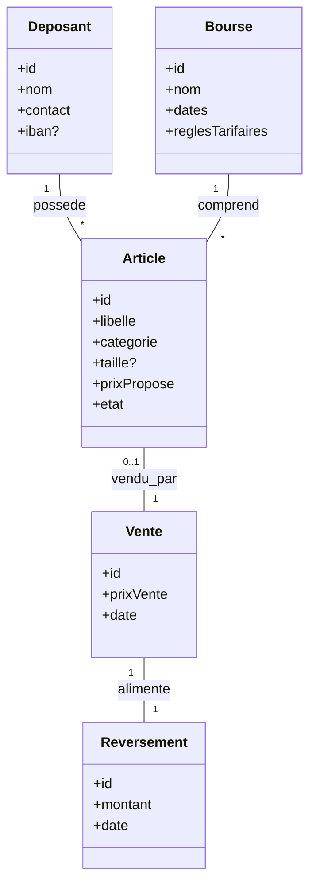

# Entités principales (ébauche)

# Règles métier (exemples)

- Une étiquette identifie de manière unique un article au sein d’une bourse.
- Le reversement = somme ventes du déposant − commissions − frais.

