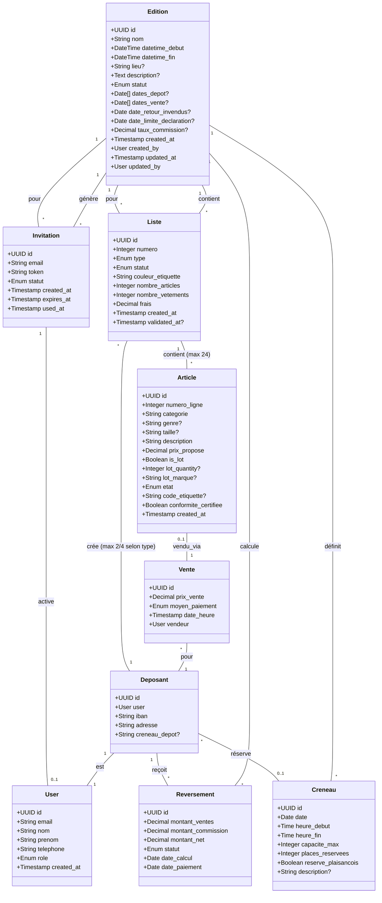
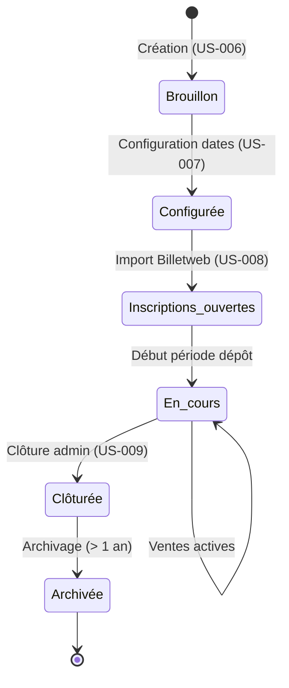
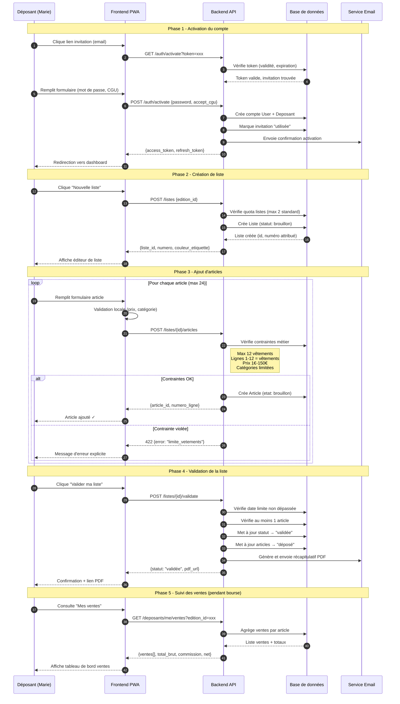
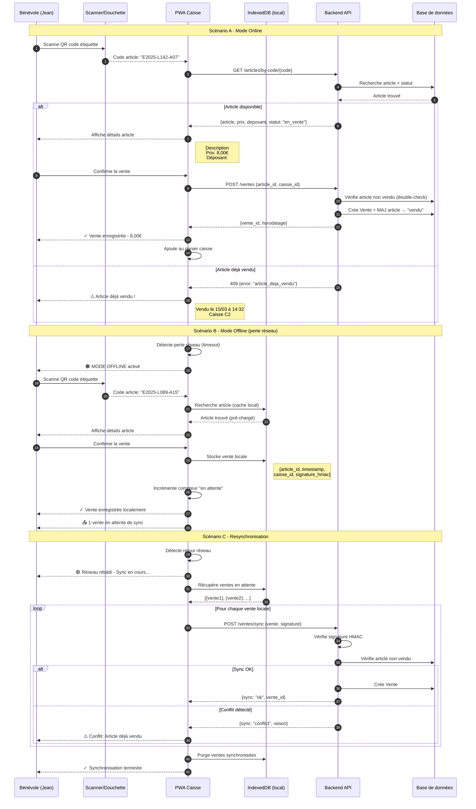
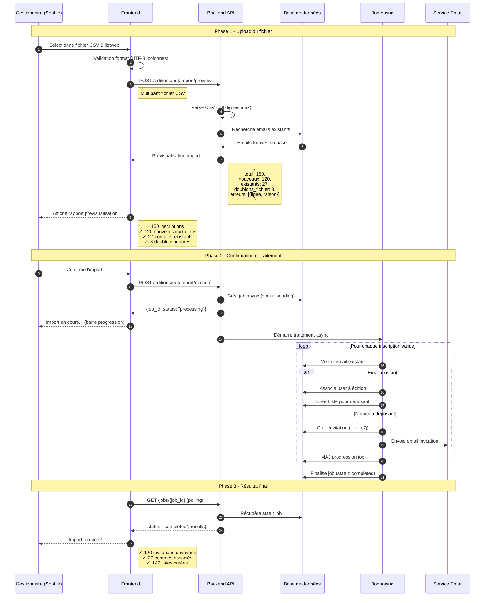
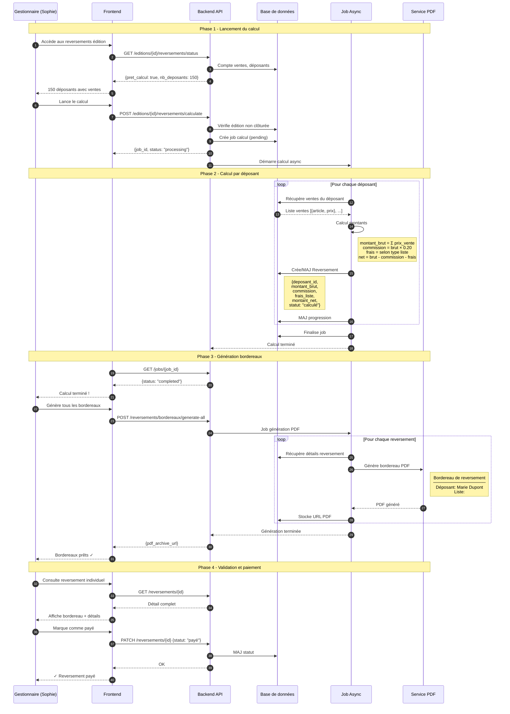
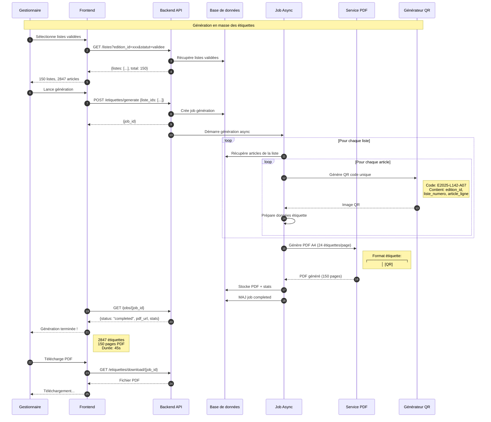
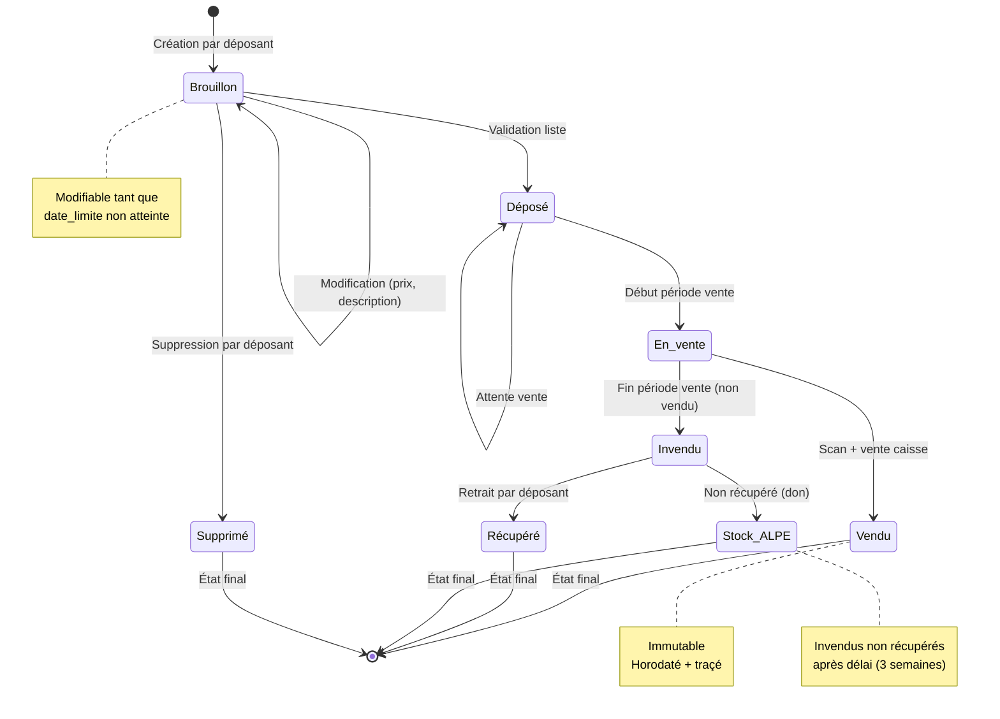
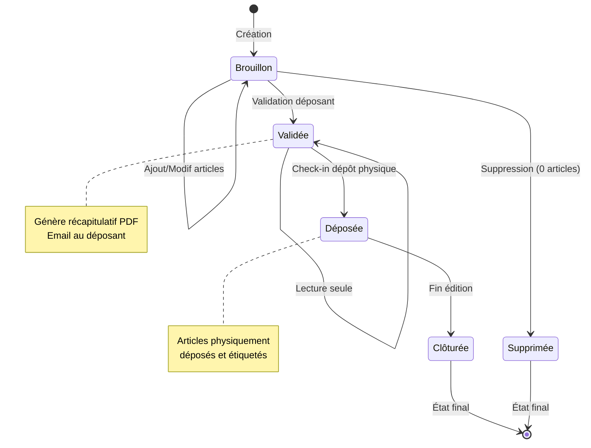
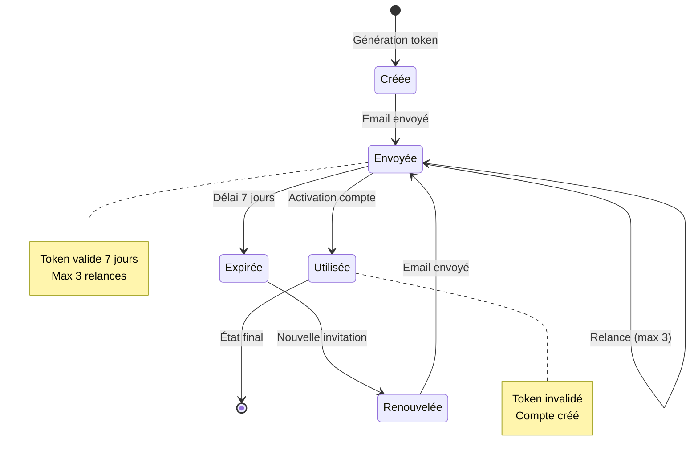

# Entités principales

# Cycle de vie d'une Édition

# Règles métier

## Édition
- Une édition a un nom unique dans tout le système (porte généralement saison et année, ex: "Bourse Printemps 2025")
- Le statut évolue selon le cycle de vie (voir diagramme)
- **Lors de la création (US-006)** : seuls nom, datetime_debut, datetime_fin sont obligatoires
- **Lors de la configuration (US-007)** : dates_depot, dates_vente, date_retour_invendus, taux_commission sont ajoutés
- La date/heure de fin doit être strictement postérieure à la date/heure de début
- Les dates de dépôt doivent être comprises dans la période temporelle de l'édition
- Les dates de vente doivent être comprises dans la période temporelle de l'édition
- La date de retour des invendus doit être postérieure à la date/heure de fin
- Le taux de commission est un pourcentage entre 0 et 100
- Le lieu et la description sont optionnels
- Une édition clôturée est en lecture seule définitive

## Utilisateurs et rôles
- **Déposant** : peut gérer ses articles pour les éditions auxquelles il est inscrit
- **Bénévole** : peut scanner et encaisser les ventes pendant une édition
- **Gestionnaire** : peut configurer les éditions et importer les inscriptions
- **Administrateur** : peut créer/clôturer des éditions et gérer les utilisateurs

## Créneaux de dépôt
- Un créneau est défini par une date, une plage horaire (heure début - heure fin) et une capacité maximum
- Chaque créneau peut être réservé aux habitants de Plaisance-du-Touch (mercredi 20h-22h, vendredi 9h30-12h)
- Exemples de capacités standard (REQ-F-014) :
  - Mercredi 9h30-11h30 : 20 déposants
  - Mercredi 14h-18h : 40 déposants
  - Mercredi 20h-22h : 20 déposants (réservé Plaisançois)
  - Jeudi 9h30-12h : 15 déposants
  - Jeudi 17h-21h : 32 déposants
  - Vendredi 9h30-12h : 15 déposants (réservé Plaisançois)
- Créneaux spéciaux pour listes 1000/2000 : mardi jusqu'à 23h, mercredi 12h-14h et 18h-20h, jeudi 21h-22h
- Les inscriptions sont bloquées une fois la capacité atteinte
- Un déposant ne peut réserver qu'un seul créneau par semaine de collecte (REQ-F-013)

## Listes
- **Types de listes** (REQ-F-015) :
  - **Standard** : maximum 2 listes par déposant par édition, frais 5€ pour 2 listes (Billetweb), couleurs 100-600 selon numéro
  - **Liste 1000** (étiquettes blanches) : réservée aux adhérents ALPE participant min 8h, numéro fixe définitif, limite 2 listes (1ère bourse) puis 4, frais 1€/liste déduit des ventes
  - **Liste 2000** (étiquettes groseille) : pour famille/amis d'adhérents ne participant pas, numérotation liée aux 1000, max 4 listes pour 2 personnes, frais 5€ pour 2 listes déduit des ventes
- Chaque liste est numérotée et rattachée à un déposant et une édition
- Une liste contient maximum 24 articles dont 12 vêtements maximum (REQ-F-002)
- Statuts possibles : brouillon, validee
- Les lignes 1-12 sont réservées aux vêtements uniquement
- Les lignes 13-24 acceptent toutes les catégories
- Une liste ne peut plus être modifiée après la date limite de déclaration (REQ-F-011 : 3 semaines avant collecte)
- Une liste validée génère un récapitulatif PDF envoyé au déposant par email
- **Couleurs d'étiquettes par numéro** :
  - 100 : Bleu ciel
  - 200 : Jaune soleil
  - 300 : Fushia
  - 400 : Lilas
  - 500 : Vert menthe
  - 600 : Clémentine
  - 1000 : Blanc
  - 2000 : Groseille
- **Horaires de restitution différenciés** (REQ-F-016) :
  - Listes standard : lundi 18h30-19h30 après la vente
  - Listes 1000/2000 : dimanche 17h-18h (jour de la vente)

## Articles
- Un article appartient à une liste unique (rattaché à un déposant et une édition via la liste)
- Chaque article occupe une ligne numérotée (1-24) dans sa liste
- Une étiquette (code) identifie de manière unique un article au sein d'une édition (générée lors du dépôt physique)
- Prix minimum : 1€ pour tout article (REQ-F-002)
- Prix maximum : 150€ uniquement pour poussettes/landaus (REQ-F-002)
- Contraintes par catégorie (REQ-F-002) :
  - Vêtements : 12 maximum par liste, lignes 1-12 obligatoires
  - Manteau/Blouson : 1 maximum par liste
  - Sac à main : 1 maximum par liste
  - Foulards : 2 maximum par liste
  - Tour de lit : 1 maximum par liste
  - Peluche : 1 maximum par liste
  - Livres adultes : 5 maximum par liste
- Lots autorisés : vêtements enfant (bodys/pyjamas) jusqu'à 36 mois, maximum 3 articles par lot, taille et marque identiques
- Un lot compte comme 1 article dans la limite des 24
- Articles de la liste noire bloqués automatiquement (sièges-autos, CD/DVD, casques, etc.)
- Certification de conformité obligatoire (case à cocher par le déposant)
- États possibles : brouillon, déposé, en_vente, vendu, invendu, récupéré
- Une fois vendu, un article ne peut plus changer d'état

## Ventes
- Une vente est associée à un article unique
- Moyens de paiement : espèces, carte_bancaire, cheque
- La vente est horodatée et traçable (bénévole vendeur)

## Reversements
- Le reversement = somme des ventes du déposant − (20% × somme ventes) − frais selon type de liste
- **Tarification ALPE** (selon règlement) :
  - **Listes standard** : Frais d'inscription 5€ pour 2 listes (payé via Billetweb en amont, non remboursable) + Commission ALPE 20% des ventes
  - **Listes 1000** : 1€ par liste déduit du montant des ventes + Commission ALPE 20% des ventes
  - **Listes 2000** : 5€ pour 2 listes déduit du montant des ventes + Commission ALPE 20% des ventes
  - Note : Pour listes standard, les frais Billetweb sont gérés hors application. Pour listes 1000/2000, les frais sont déduits automatiquement du reversement
- Calculé après la période de vente, avant clôture
- Versement par chèque sous quinzaine (enveloppe timbrée fournie par le déposant)
- Statuts : en_attente, calculé, payé, annulé
- Un reversement est lié à un déposant pour une édition donnée

## Invitations
- Une invitation a un token unique et une durée de validité de 7 jours
- Statuts : envoyée, utilisée, expirée
- Un token ne peut être utilisé qu'une seule fois
- Les invitations sont générées lors de l'import Billetweb (US-008)

# Invariants

- **Unicité email** : Un email ne peut être associé qu'à un seul utilisateur
- **Unicité étiquette/édition** : Un code étiquette est unique au sein d'une édition
- **Unicité nom édition** : Le nom d'une édition est unique globalement
- **Cohérence dates/heures édition** : datetime_debut < datetime_fin
- **Cohérence dates opérationnelles** : dates_depot et dates_vente comprises dans la période temporelle de l'édition
- **Cohérence date retour invendus** : date_retour_invendus doit être postérieure à la partie date de datetime_fin
- **Cohérence date limite déclaration** : date_limite_declaration doit être antérieure à la première date de dépôt (recommandé : 3 semaines avant)
- **Maximum listes selon type** :
  - Listes standard : 2 maximum par déposant par édition
  - Listes 1000 : 2 pour première bourse, puis 4 pour adhérent régulier
  - Listes 2000 : 4 maximum pour 2 personnes
- **Un seul dépôt par semaine** : Un déposant ne peut effectuer qu'un seul dépôt physique par semaine de collecte (REQ-F-013)
- **Capacité créneau** : Le nombre de réservations pour un créneau ne peut dépasser sa capacité maximum
- **Créneau Plaisançois** : Les créneaux réservés Plaisançois ne peuvent être réservés que par des habitants de Plaisance-du-Touch
- **Maximum 24 articles par liste** : Une liste ne peut contenir plus de 24 articles
- **Maximum 12 vêtements par liste** : Une liste ne peut contenir plus de 12 articles de catégorie "Vêtements"
- **Lignes 1-12 réservées vêtements** : Les articles en lignes 1-12 doivent obligatoirement être de catégorie "Vêtements"
- **Prix article ≥ 1€** : Le prix proposé d'un article doit être au minimum 1€
- **Prix poussette ≤ 150€** : Le prix d'une poussette/landau ne peut dépasser 150€
- **Contraintes catégorie respectées** : Les contraintes par catégorie (1 manteau, 2 foulards, etc.) doivent être respectées par liste
- **Article → Vente** : Un article ne peut avoir qu'une seule vente (0..1 relation)
- **Édition clôturée** : Aucune modification possible après clôture
- **Liste après date limite** : Aucune modification de liste possible après date_limite_declaration
- **Invitation expirée** : Un token expiré ne peut plus être utilisé
- **Numérotation 1000/2000** : Les numéros 2000 correspondent aux numéros 1000 (ex: 1100 → 2100)

---

# Diagrammes séquence

## Parcours dépôt d'articles (Déposant)

Ce diagramme illustre le parcours complet d'un déposant depuis l'activation de son compte jusqu'à la validation de sa liste.

## Parcours vente en caisse (Bénévole)

Ce diagramme illustre le processus de vente d'un article en caisse, incluant le mode offline.

## Parcours import Billetweb (Gestionnaire)

Ce diagramme illustre le processus d'import des inscriptions depuis Billetweb.

## Parcours calcul reversements (Fin d'édition)

Ce diagramme illustre le processus de calcul des reversements après la bourse.

## Parcours génération étiquettes (Gestionnaire)

---

# Cycle de vie des entités

## Cycle de vie d'un Article

### Transitions détaillées

| État initial | Événement | État final | Conditions | Actions |
|--------------|-----------|------------|------------|---------|
| — | Création article | Brouillon | Liste en brouillon, contraintes OK | Assigne numéro ligne |
| Brouillon | Modification | Brouillon | Date limite non atteinte | MAJ champs |
| Brouillon | Suppression | Supprimé | Date limite non atteinte | Soft delete |
| Brouillon | Validation liste | Déposé | Liste validée | Génère code étiquette |
| Déposé | Début vente | En_vente | Édition en cours | — |
| En_vente | Vente | Vendu | Article non vendu | Crée Vente, horodate |
| En_vente | Fin vente | Invendu | Période vente terminée | — |
| Invendu | Récupération | Récupéré | Déposant présent | Trace récupération |
| Invendu | Délai dépassé | Stock_ALPE | +3 semaines sans récup | Don automatique |

## Cycle de vie d'une Liste

## Cycle de vie d'une Invitation

---

# Matrice des transitions d'état

## Article : Actions autorisées par état

| Action | Brouillon | Déposé | En_vente | Vendu | Invendu | Récupéré |
|--------|-----------|--------|----------|-------|---------|----------|
| Modifier | ✅ | ❌ | ❌ | ❌ | ❌ | ❌ |
| Supprimer | ✅ | ❌ | ❌ | ❌ | ❌ | ❌ |
| Valider (via liste) | ✅ | — | — | — | — | — |
| Vendre | ❌ | ❌ | ✅ | ❌ | ❌ | ❌ |
| Annuler vente | ❌ | ❌ | ❌ | ✅* | ❌ | ❌ |
| Récupérer | ❌ | ❌ | ❌ | ❌ | ✅ | — |

*Annulation vente : uniquement par Gestionnaire/Admin

## Liste : Actions autorisées par état

| Action | Brouillon | Validée | Déposée | Clôturée |
|--------|-----------|---------|---------|----------|
| Ajouter article | ✅ | ❌ | ❌ | ❌ |
| Modifier article | ✅ | ❌ | ❌ | ❌ |
| Supprimer article | ✅ | ❌ | ❌ | ❌ |
| Valider | ✅ | — | — | — |
| Invalider | ❌ | ✅* | ❌ | ❌ |
| Check-in dépôt | ❌ | ✅ | — | — |
| Consulter | ✅ | ✅ | ✅ | ✅ |

*Invalidation : uniquement par Gestionnaire (cas exceptionnel)

