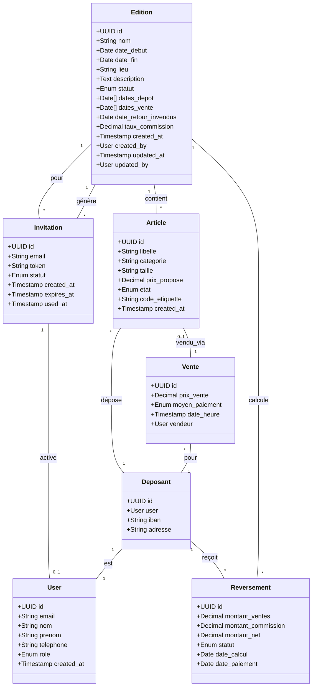
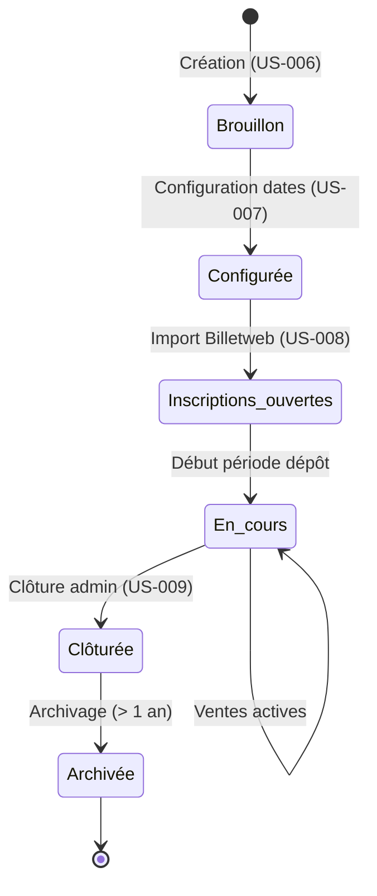

# Entités principales

# Cycle de vie d'une Édition

# Règles métier

## Édition
- Une édition a un nom unique dans tout le système (porte généralement saison et année, ex: "Bourse Printemps 2025")
- Le statut évolue selon le cycle de vie (voir diagramme)
- La date de fin doit être strictement postérieure à la date de début
- Les dates de dépôt doivent être comprises dans la période [date_debut, date_fin]
- Les dates de vente doivent être comprises dans la période [date_debut, date_fin]
- La date de retour des invendus doit être postérieure ou égale à la date de fin
- L'ordre chronologique attendu : date_debut ≤ dates_depot ≤ dates_vente ≤ date_fin ≤ date_retour_invendus
- Le taux de commission est un pourcentage entre 0 et 100
- Le lieu est optionnel (peut être précisé ultérieurement)
- Une édition clôturée est en lecture seule définitive

## Utilisateurs et rôles
- **Déposant** : peut gérer ses articles pour les éditions auxquelles il est inscrit
- **Bénévole** : peut scanner et encaisser les ventes pendant une édition
- **Gestionnaire** : peut configurer les éditions et importer les inscriptions
- **Administrateur** : peut créer/clôturer des éditions et gérer les utilisateurs

## Articles
- Une étiquette (code) identifie de manière unique un article au sein d'une édition
- Un article appartient à un seul déposant et une seule édition
- États possibles : brouillon, déposé, en_vente, vendu, invendu, récupéré
- Une fois vendu, un article ne peut plus changer d'état

## Ventes
- Une vente est associée à un article unique
- Moyens de paiement : espèces, carte_bancaire, cheque
- La vente est horodatée et traçable (bénévole vendeur)

## Reversements
- Le reversement = somme des ventes du déposant − (commission × somme ventes)
- Calculé après la période de vente, avant clôture
- Statuts : en_attente, calculé, payé, annulé
- Un reversement est lié à un déposant pour une édition donnée

## Invitations
- Une invitation a un token unique et une durée de validité de 7 jours
- Statuts : envoyée, utilisée, expirée
- Un token ne peut être utilisé qu'une seule fois
- Les invitations sont générées lors de l'import Billetweb (US-008)

# Invariants

- **Unicité email** : Un email ne peut être associé qu'à un seul utilisateur
- **Unicité étiquette/édition** : Un code étiquette est unique au sein d'une édition
- **Unicité nom édition** : Le nom d'une édition est unique globalement
- **Cohérence dates édition** : date_debut < date_fin ET date_fin ≤ date_retour_invendus
- **Cohérence dates opérationnelles** : dates_depot ⊆ [date_debut, date_fin] ET dates_vente ⊆ [date_debut, date_fin]
- **Article → Vente** : Un article ne peut avoir qu'une seule vente (0..1 relation)
- **Édition clôturée** : Aucune modification possible après clôture
- **Invitation expirée** : Un token expiré ne peut plus être utilisé

