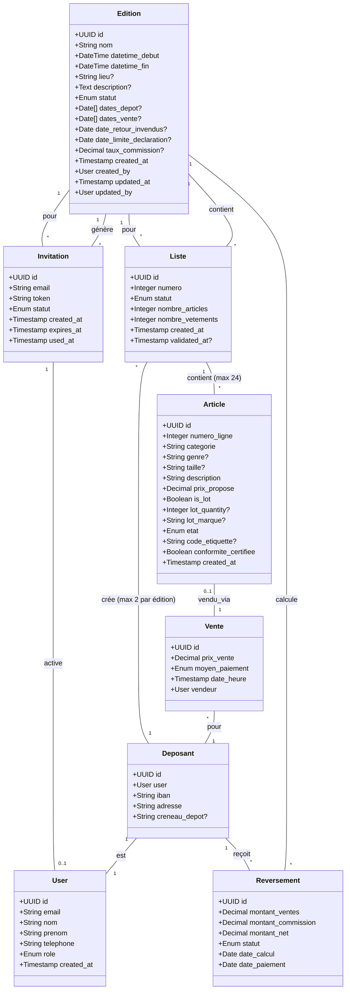
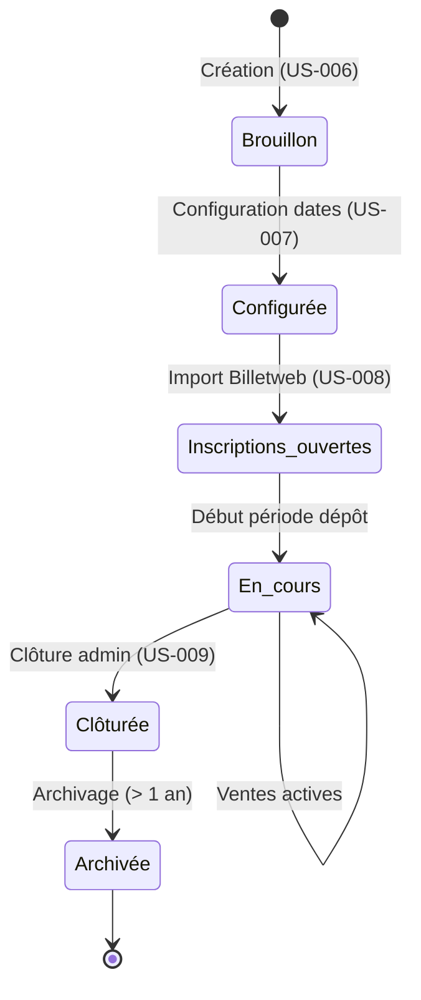

# Entités principales

# Cycle de vie d'une Édition

# Règles métier

## Édition
- Une édition a un nom unique dans tout le système (porte généralement saison et année, ex: "Bourse Printemps 2025")
- Le statut évolue selon le cycle de vie (voir diagramme)
- **Lors de la création (US-006)** : seuls nom, datetime_debut, datetime_fin sont obligatoires
- **Lors de la configuration (US-007)** : dates_depot, dates_vente, date_retour_invendus, taux_commission sont ajoutés
- La date/heure de fin doit être strictement postérieure à la date/heure de début
- Les dates de dépôt doivent être comprises dans la période temporelle de l'édition
- Les dates de vente doivent être comprises dans la période temporelle de l'édition
- La date de retour des invendus doit être postérieure à la date/heure de fin
- Le taux de commission est un pourcentage entre 0 et 100
- Le lieu et la description sont optionnels
- Une édition clôturée est en lecture seule définitive

## Utilisateurs et rôles
- **Déposant** : peut gérer ses articles pour les éditions auxquelles il est inscrit
- **Bénévole** : peut scanner et encaisser les ventes pendant une édition
- **Gestionnaire** : peut configurer les éditions et importer les inscriptions
- **Administrateur** : peut créer/clôturer des éditions et gérer les utilisateurs

## Listes
- Un déposant peut créer maximum 2 listes par édition (REQ-F-002)
- Chaque liste est numérotée (1 ou 2) et rattachée à un déposant et une édition
- Une liste contient maximum 24 articles dont 12 vêtements maximum (REQ-F-002)
- Statuts possibles : brouillon, validee
- Les lignes 1-12 sont réservées aux vêtements uniquement
- Les lignes 13-24 acceptent toutes les catégories
- Une liste ne peut plus être modifiée après la date limite de déclaration (REQ-F-011)
- Une liste validée génère un récapitulatif PDF envoyé au déposant par email

## Articles
- Un article appartient à une liste unique (rattaché à un déposant et une édition via la liste)
- Chaque article occupe une ligne numérotée (1-24) dans sa liste
- Une étiquette (code) identifie de manière unique un article au sein d'une édition (générée lors du dépôt physique)
- Prix minimum : 1€ pour tout article (REQ-F-002)
- Prix maximum : 150€ uniquement pour poussettes/landaus (REQ-F-002)
- Contraintes par catégorie (REQ-F-002) :
  - Vêtements : 12 maximum par liste, lignes 1-12 obligatoires
  - Manteau/Blouson : 1 maximum par liste
  - Sac à main : 1 maximum par liste
  - Foulards : 2 maximum par liste
  - Tour de lit : 1 maximum par liste
  - Peluche : 1 maximum par liste
  - Livres adultes : 5 maximum par liste
- Lots autorisés : vêtements enfant (bodys/pyjamas) jusqu'à 36 mois, maximum 3 articles par lot, taille et marque identiques
- Un lot compte comme 1 article dans la limite des 24
- Articles de la liste noire bloqués automatiquement (sièges-autos, CD/DVD, casques, etc.)
- Certification de conformité obligatoire (case à cocher par le déposant)
- États possibles : brouillon, déposé, en_vente, vendu, invendu, récupéré
- Une fois vendu, un article ne peut plus changer d'état

## Ventes
- Une vente est associée à un article unique
- Moyens de paiement : espèces, carte_bancaire, cheque
- La vente est horodatée et traçable (bénévole vendeur)

## Reversements
- Le reversement = somme des ventes du déposant − (20% × somme ventes)
- Tarification ALPE (selon règlement) :
  - Frais d'inscription : 5€ pour 2 listes (payé via Billetweb, non remboursable)
  - Commission ALPE : 20% du montant total des ventes
  - Note : Les frais d'inscription sont gérés hors application, seule la commission de 20% est calculée ici
- Calculé après la période de vente, avant clôture
- Versement par chèque sous quinzaine (enveloppe timbrée fournie par le déposant)
- Statuts : en_attente, calculé, payé, annulé
- Un reversement est lié à un déposant pour une édition donnée

## Invitations
- Une invitation a un token unique et une durée de validité de 7 jours
- Statuts : envoyée, utilisée, expirée
- Un token ne peut être utilisé qu'une seule fois
- Les invitations sont générées lors de l'import Billetweb (US-008)

# Invariants

- **Unicité email** : Un email ne peut être associé qu'à un seul utilisateur
- **Unicité étiquette/édition** : Un code étiquette est unique au sein d'une édition
- **Unicité nom édition** : Le nom d'une édition est unique globalement
- **Cohérence dates/heures édition** : datetime_debut < datetime_fin
- **Cohérence dates opérationnelles** : dates_depot et dates_vente comprises dans la période temporelle de l'édition
- **Cohérence date retour invendus** : date_retour_invendus doit être postérieure à la partie date de datetime_fin
- **Cohérence date limite déclaration** : date_limite_declaration doit être antérieure à la première date de dépôt
- **Maximum 2 listes par déposant/édition** : Un déposant ne peut créer que 2 listes maximum pour une édition donnée
- **Maximum 24 articles par liste** : Une liste ne peut contenir plus de 24 articles
- **Maximum 12 vêtements par liste** : Une liste ne peut contenir plus de 12 articles de catégorie "Vêtements"
- **Lignes 1-12 réservées vêtements** : Les articles en lignes 1-12 doivent obligatoirement être de catégorie "Vêtements"
- **Prix article ≥ 1€** : Le prix proposé d'un article doit être au minimum 1€
- **Prix poussette ≤ 150€** : Le prix d'une poussette/landau ne peut dépasser 150€
- **Contraintes catégorie respectées** : Les contraintes par catégorie (1 manteau, 2 foulards, etc.) doivent être respectées par liste
- **Article → Vente** : Un article ne peut avoir qu'une seule vente (0..1 relation)
- **Édition clôturée** : Aucune modification possible après clôture
- **Liste après date limite** : Aucune modification de liste possible après date_limite_declaration
- **Invitation expirée** : Un token expiré ne peut plus être utilisé

