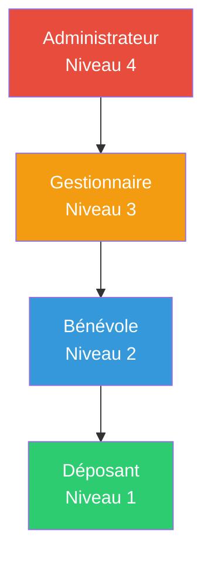
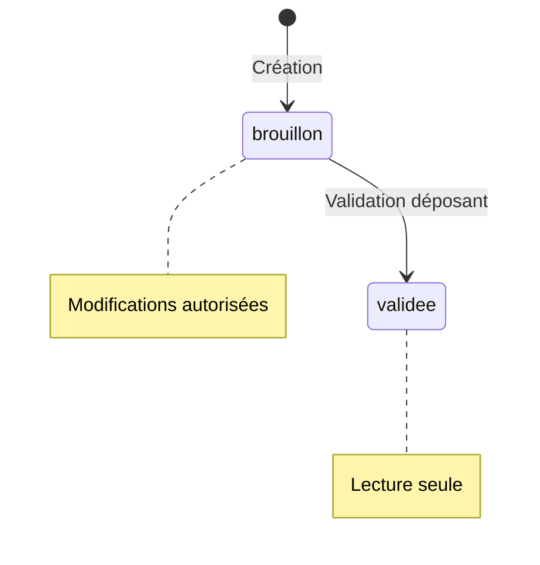

# 1. Vue d'ensemble

Ce document définit la politique de sécurité de l'application Gestionnaire de Bourse ALPE, incluant :
- La matrice d'autorisations par rôle
- Les règles d'authentification
- La protection des données (RGPD)
- Les mécanismes de traçabilité

---

# 2. Rôles et hiérarchie

## 2.1 Définition des rôles

| Rôle | Code | Description | Niveau |
|------|------|-------------|--------|
| **Déposant** | `deposant` | Vendeur inscrit à une édition, gère ses propres articles | 1 |
| **Bénévole** | `benevole` | Membre actif pendant la bourse, opère les caisses | 2 |
| **Gestionnaire** | `gestionnaire` | Organise les éditions, configure et supervise | 3 |
| **Administrateur** | `admin` | Contrôle total sur le système | 4 |

## 2.2 Hiérarchie des permissions



**Règle** : Un rôle de niveau N hérite des permissions de lecture du niveau N-1, mais pas des permissions d'écriture sur les ressources personnelles.

---

# 3. Matrice d'autorisations CRUD

## 3.1 Légende

| Symbole | Signification |
|---------|---------------|
| ✅ | Accès complet |
| 📖 | Lecture seule |
| 🔒 | Ses propres données uniquement |
| ⚡ | Action spécifique (non CRUD) |
| ❌ | Aucun accès |

## 3.2 Ressources système

### Éditions

| Opération | Déposant | Bénévole | Gestionnaire | Admin |
|-----------|:--------:|:--------:|:------------:|:-----:|
| Lister les éditions | 📖 | 📖 | 📖 | ✅ |
| Voir détails édition | 📖 | 📖 | 📖 | ✅ |
| Créer une édition | ❌ | ❌ | ❌ | ✅ |
| Modifier une édition | ❌ | ❌ | ✅ | ✅ |
| Configurer dates/commission | ❌ | ❌ | ✅ | ✅ |
| Importer inscriptions | ❌ | ❌ | ✅ | ✅ |
| Clôturer une édition | ❌ | ❌ | ❌ | ✅ |
| Archiver une édition | ❌ | ❌ | ❌ | ✅ |

### Créneaux de dépôt

| Opération | Déposant | Bénévole | Gestionnaire | Admin |
|-----------|:--------:|:--------:|:------------:|:-----:|
| Lister les créneaux | 📖 | 📖 | 📖 | ✅ |
| Voir disponibilités | 📖 | 📖 | 📖 | ✅ |
| Créer un créneau | ❌ | ❌ | ✅ | ✅ |
| Modifier un créneau | ❌ | ❌ | ✅ | ✅ |
| Supprimer un créneau | ❌ | ❌ | ✅ | ✅ |
| Réserver un créneau | 🔒 | ❌ | ✅ | ✅ |

### Utilisateurs

| Opération | Déposant | Bénévole | Gestionnaire | Admin |
|-----------|:--------:|:--------:|:------------:|:-----:|
| Voir son profil | 🔒 | 🔒 | 🔒 | 🔒 |
| Modifier son profil | 🔒 | 🔒 | 🔒 | 🔒 |
| Changer son mot de passe | 🔒 | 🔒 | 🔒 | 🔒 |
| Lister tous les utilisateurs | ❌ | ❌ | 📖 | ✅ |
| Voir un autre utilisateur | ❌ | ❌ | 📖 | ✅ |
| Créer un utilisateur | ❌ | ❌ | ❌ | ✅ |
| Modifier un utilisateur | ❌ | ❌ | ❌ | ✅ |
| Supprimer/anonymiser | ❌ | ❌ | ❌ | ✅ |
| Changer le rôle | ❌ | ❌ | ❌ | ✅ |

### Invitations

| Opération | Déposant | Bénévole | Gestionnaire | Admin |
|-----------|:--------:|:--------:|:------------:|:-----:|
| Lister les invitations | ❌ | ❌ | 📖 | ✅ |
| Créer une invitation | ❌ | ❌ | ✅ | ✅ |
| Import CSV en masse | ❌ | ❌ | ✅ | ✅ |
| Renvoyer une invitation | ❌ | ❌ | ✅ | ✅ |
| Activer son compte (via token) | ⚡ | ⚡ | ⚡ | ⚡ |

## 3.3 Ressources métier

### Listes d'articles

| Opération | Déposant | Bénévole | Gestionnaire | Admin |
|-----------|:--------:|:--------:|:------------:|:-----:|
| Voir ses propres listes | 🔒 | 🔒 | 🔒 | 🔒 |
| Lister toutes les listes | ❌ | 📖 | 📖 | ✅ |
| Créer une liste | 🔒 | ❌ | ❌ | ✅ |
| Modifier sa liste | 🔒 | ❌ | ❌ | ❌ |
| Supprimer sa liste | 🔒 | ❌ | ❌ | ✅ |
| Valider sa liste | 🔒 | ❌ | ❌ | ❌ |
| Invalider une liste | ❌ | ❌ | ✅ | ✅ |

### Articles

| Opération | Déposant | Bénévole | Gestionnaire | Admin |
|-----------|:--------:|:--------:|:------------:|:-----:|
| Voir ses propres articles | 🔒 | 🔒 | 🔒 | 🔒 |
| Voir tous les articles | ❌ | 📖 | 📖 | ✅ |
| Ajouter un article | 🔒 | ❌ | ❌ | ❌ |
| Modifier son article | 🔒 | ❌ | ❌ | ❌ |
| Supprimer son article | 🔒 | ❌ | ❌ | ✅ |
| Dupliquer un article | 🔒 | ❌ | ❌ | ❌ |
| Rechercher par code | ❌ | ✅ | ✅ | ✅ |

### Étiquettes

| Opération | Déposant | Bénévole | Gestionnaire | Admin |
|-----------|:--------:|:--------:|:------------:|:-----:|
| Voir ses étiquettes | 🔒 | ❌ | ❌ | ❌ |
| Générer étiquettes (batch) | ❌ | ❌ | ✅ | ✅ |
| Télécharger PDF étiquettes | ❌ | ✅ | ✅ | ✅ |
| Voir stats génération | ❌ | ❌ | 📖 | ✅ |
| Régénérer étiquettes | ❌ | ❌ | ✅ | ✅ |

### Ventes (Caisse)

| Opération | Déposant | Bénévole | Gestionnaire | Admin |
|-----------|:--------:|:--------:|:------------:|:-----:|
| Scanner un article | ❌ | ✅ | ✅ | ✅ |
| Enregistrer une vente | ❌ | ✅ | ✅ | ✅ |
| Voir ses propres ventes | 🔒 | ❌ | ❌ | ❌ |
| Lister toutes les ventes | ❌ | 📖 | 📖 | ✅ |
| Annuler une vente | ❌ | ❌ | ✅ | ✅ |
| Synchroniser ventes offline | ❌ | ✅ | ✅ | ✅ |

### Reversements

| Opération | Déposant | Bénévole | Gestionnaire | Admin |
|-----------|:--------:|:--------:|:------------:|:-----:|
| Voir son reversement | 🔒 | ❌ | ❌ | ❌ |
| Lister tous les reversements | ❌ | ❌ | 📖 | ✅ |
| Calculer les reversements | ❌ | ❌ | ✅ | ✅ |
| Générer bordereaux PDF | ❌ | ❌ | ✅ | ✅ |
| Télécharger son bordereau | 🔒 | ❌ | ❌ | ❌ |
| Télécharger un bordereau | ❌ | ❌ | ✅ | ✅ |
| Enregistrer paiement | ❌ | ❌ | ✅ | ✅ |

### Statistiques

| Opération | Déposant | Bénévole | Gestionnaire | Admin |
|-----------|:--------:|:--------:|:------------:|:-----:|
| Voir ses stats personnelles | 🔒 | ❌ | ❌ | ❌ |
| Voir stats édition | ❌ | 📖 | 📖 | ✅ |
| Voir dashboard ventes live | ❌ | 📖 | ✅ | ✅ |
| Exporter données | ❌ | ❌ | ✅ | ✅ |

---

# 4. Règles de sécurité par endpoint

## 4.1 Endpoints publics (sans authentification)

| Endpoint | Description |
|----------|-------------|
| `POST /auth/login` | Connexion |
| `POST /auth/refresh` | Rafraîchissement token |
| `POST /auth/activate` | Activation compte via invitation |
| `POST /auth/password/reset-request` | Demande reset mot de passe |
| `POST /auth/password/reset` | Reset mot de passe |

## 4.2 Endpoints par rôle minimum requis

### Déposant (niveau 1)

```
GET    /users/me                           # Son profil
PATCH  /users/me                           # Modifier son profil
GET    /editions                           # Lister éditions (lecture)
GET    /editions/{id}                      # Détails édition (lecture)
GET    /editions/{id}/creneaux             # Créneaux disponibles
GET    /editions/{id}/listes               # Ses propres listes uniquement
POST   /editions/{id}/listes               # Créer une liste
GET    /editions/{id}/listes/{id}          # Sa liste uniquement
DELETE /editions/{id}/listes/{id}          # Supprimer sa liste
POST   /editions/{id}/listes/{id}/valider  # Valider sa liste
GET    /editions/{id}/listes/{id}/articles # Ses articles
POST   /editions/{id}/listes/{id}/articles # Ajouter article
PATCH  /editions/{id}/listes/{id}/articles/{id}     # Modifier son article
DELETE /editions/{id}/listes/{id}/articles/{id}     # Supprimer son article
POST   /editions/{id}/listes/{id}/articles/{id}/dupliquer  # Dupliquer
```

### Bénévole (niveau 2)

Hérite des accès déposant (lecture) + :

```
POST   /editions/{id}/ventes/scan          # Scanner article
POST   /editions/{id}/ventes               # Enregistrer vente
GET    /editions/{id}/ventes               # Lister ventes (lecture)
POST   /editions/{id}/ventes/sync          # Sync offline
GET    /editions/{id}/etiquettes/download/{jobId}  # Télécharger PDF
GET    /editions/{id}/stats                # Stats édition (lecture)
GET    /editions/{id}/stats/ventes-live    # Dashboard live (lecture)
```

### Gestionnaire (niveau 3)

Hérite des accès bénévole + :

```
PATCH  /editions/{id}                      # Modifier édition
POST   /editions/{id}/configure            # Configurer dates
POST   /editions/{id}/import-inscriptions  # Import Billetweb
GET    /editions/{id}/invitations          # Lister invitations
POST   /editions/{id}/invitations          # Créer invitation
POST   /editions/{id}/invitations/bulk     # Import CSV invitations
POST   /editions/{id}/invitations/{id}/resend  # Renvoyer
POST   /editions/{id}/creneaux             # Créer créneau
PATCH  /editions/{id}/creneaux/{id}        # Modifier créneau
DELETE /editions/{id}/creneaux/{id}        # Supprimer créneau
POST   /editions/{id}/etiquettes/generer   # Générer étiquettes
GET    /editions/{id}/etiquettes/jobs/{id} # Statut génération
GET    /editions/{id}/etiquettes/stats     # Stats étiquettes
POST   /editions/{id}/ventes/{id}/annuler  # Annuler vente
GET    /editions/{id}/reversements         # Lister reversements
POST   /editions/{id}/reversements/calculer # Calculer
GET    /editions/{id}/reversements/{id}    # Détails reversement
GET    /editions/{id}/reversements/{id}/bordereau  # PDF bordereau
POST   /editions/{id}/reversements/{id}/payer      # Enregistrer paiement
POST   /editions/{id}/reversements/bordereaux      # Générer tous bordereaux
GET    /users                              # Lister utilisateurs (lecture)
GET    /users/{id}                         # Détails utilisateur (lecture)
```

### Administrateur (niveau 4)

Accès complet à tous les endpoints + :

```
POST   /editions                           # Créer édition
POST   /editions/{id}/cloturer             # Clôturer édition
POST   /users                              # Créer utilisateur
PATCH  /users/{id}                         # Modifier utilisateur
DELETE /users/{id}                         # Supprimer/anonymiser
```

---

# 5. Règles de propriété des données

## 5.1 Isolation des données déposant

Un déposant ne peut accéder qu'à ses propres ressources :

```python
# Pseudo-code de vérification
def check_deposant_access(user, resource):
    if user.role == 'deposant':
        if resource.type in ['liste', 'article', 'reversement']:
            return resource.deposant_id == user.id
        elif resource.type == 'vente':
            return resource.article.liste.deposant_id == user.id
    return True  # Autres rôles ont plus de droits
```

## 5.2 Contraintes temporelles

| Ressource | Contrainte |
|-----------|------------|
| Liste | Non modifiable après `date_limite_declaration` |
| Liste | Non modifiable après validation |
| Article | Non modifiable si `etat` != 'brouillon' |
| Édition | Non modifiable si `statut` = 'cloturee' ou 'archivee' |
| Vente | Annulation uniquement par gestionnaire+ |

## 5.3 Contraintes d'état



---

# 6. Authentification

## 6.1 Mécanisme JWT

| Paramètre | Valeur |
|-----------|--------|
| Algorithme | HS256 ou RS256 |
| Access Token TTL | 15 minutes |
| Refresh Token TTL | 7 jours |
| Stockage client | HttpOnly cookie (refresh) + Memory (access) |

## 6.2 Payload du token

```json
{
  "sub": "user-uuid",
  "email": "user@example.com",
  "role": "deposant",
  "edition_id": "edition-uuid",  // Si contexte édition
  "iat": 1703376000,
  "exp": 1703376900
}
```

## 6.3 Politique de mot de passe

| Critère | Exigence |
|---------|----------|
| Longueur minimale | 8 caractères |
| Complexité | 1 lettre + 1 chiffre + 1 caractère spécial |
| Historique | 3 derniers mots de passe interdits |
| Expiration | Pas d'expiration forcée |
| Tentatives échouées | Blocage 15 min après 5 échecs |

## 6.4 Sessions et déconnexion

- Déconnexion : invalidation du refresh token
- Session unique : un refresh token actif par utilisateur
- Révocation : possibilité de révoquer tous les tokens (admin)

---

# 7. Protection des données (RGPD)

## 7.1 Données personnelles collectées

| Donnée | Finalité | Base légale | Durée conservation |
|--------|----------|-------------|-------------------|
| Email | Identification, communication | Contrat | Durée du compte + 3 ans |
| Nom, Prénom | Identification | Contrat | Durée du compte + 3 ans |
| Téléphone | Contact urgence | Intérêt légitime | Durée de l'édition |
| Adresse | Livraison chèque | Contrat | Durée de l'édition |
| IBAN | Virement reversement | Contrat | Durée de l'édition + 1 an |

## 7.2 Droits des utilisateurs

| Droit | Implémentation |
|-------|----------------|
| **Accès** | Export JSON via `GET /users/me/data` |
| **Rectification** | Modification profil via `PATCH /users/me` |
| **Effacement** | Anonymisation via `DELETE /users/{id}` (admin) ou demande |
| **Portabilité** | Export JSON/CSV des données |
| **Opposition** | Désinscription des communications |

## 7.3 Anonymisation

Lors de la suppression d'un compte :

```json
{
  "email": "anonyme-{uuid}@deleted.local",
  "nom": "ANONYME",
  "prenom": "Utilisateur",
  "telephone": null,
  "adresse": null,
  "iban": null,
  "deleted_at": "2025-12-24T12:00:00Z"
}
```

Les données de vente sont conservées pour la comptabilité mais anonymisées.

## 7.4 Chiffrement

| Donnée | Méthode |
|--------|---------|
| Mot de passe | bcrypt (cost factor 12) ou Argon2id |
| IBAN | AES-256-GCM (clé serveur) |
| Communications | HTTPS TLS 1.3 |
| Backup | Chiffrement AES-256 |

---

# 8. Journalisation et audit

## 8.1 Événements journalisés

| Catégorie | Événements |
|-----------|------------|
| **Authentification** | Login, logout, échec login, reset password |
| **Utilisateurs** | Création, modification, suppression, changement rôle |
| **Éditions** | Création, configuration, import, clôture |
| **Ventes** | Enregistrement, annulation |
| **Reversements** | Calcul, paiement |
| **Accès sensibles** | Export données, téléchargement bordereaux |

## 8.2 Format des logs

```json
{
  "timestamp": "2025-12-24T14:30:00Z",
  "level": "INFO",
  "event": "VENTE_ANNULEE",
  "user_id": "uuid",
  "user_role": "gestionnaire",
  "resource_type": "vente",
  "resource_id": "uuid",
  "details": {
    "motif": "Erreur de scan",
    "article_id": "uuid"
  },
  "ip": "192.168.1.100",
  "user_agent": "Mozilla/5.0..."
}
```

## 8.3 Rétention des logs

| Type | Durée |
|------|-------|
| Logs applicatifs | 90 jours |
| Logs d'audit sécurité | 1 an |
| Logs de transactions | 5 ans (obligation légale) |

---

# 9. Sécurité applicative

## 9.1 Protection contre les attaques courantes

| Attaque | Protection |
|---------|------------|
| **Injection SQL** | ORM (SQLAlchemy), requêtes paramétrées |
| **XSS** | Échappement automatique (React), CSP headers |
| **CSRF** | Tokens CSRF, SameSite cookies |
| **Brute force** | Rate limiting, blocage temporaire |
| **Session hijacking** | HttpOnly cookies, rotation tokens |

## 9.2 Headers de sécurité

```
Strict-Transport-Security: max-age=31536000; includeSubDomains
X-Content-Type-Options: nosniff
X-Frame-Options: DENY
X-XSS-Protection: 1; mode=block
Content-Security-Policy: default-src 'self'; script-src 'self'
Referrer-Policy: strict-origin-when-cross-origin
```

## 9.3 Rate limiting

| Endpoint | Limite |
|----------|--------|
| `POST /auth/login` | 5 req/15 min par IP |
| `POST /auth/password/reset-request` | 3 req/heure par email |
| API générale (authentifié) | 100 req/min par utilisateur |
| Génération PDF | 10 req/min par utilisateur |

---

# 10. Sécurité des caisses (mode offline)

## 10.1 Risques spécifiques

| Risque | Mitigation |
|--------|------------|
| Vol de tablette | Session courte (30 min), verrouillage auto |
| Double vente | Verrouillage optimiste, alerte sync |
| Manipulation données | Signature des ventes offline |
| Accès non autorisé | Code PIN caisse + authentification |

## 10.2 Authentification caisse

1. Login utilisateur (bénévole+)
2. Sélection du numéro de caisse (1-5)
3. Session caisse active jusqu'à déconnexion
4. Verrouillage auto après 5 min d'inactivité

## 10.3 Intégrité des ventes offline

```json
{
  "offline_id": "uuid-client",
  "code_etiquette": "EDI-2024-11-L245-A03",
  "moyen_paiement": "especes",
  "timestamp_local": "2025-12-24T14:30:00Z",
  "caisse_id": 2,
  "signature": "hmac-sha256(payload, secret_caisse)"
}
```

---

# 11. Anti-fraude étiquettes

## 11.1 Unicité des codes

Format du code étiquette : `{EDITION}-{LISTE}-A{NUMERO}`

Exemple : `BP2025-L245-A03`

- `BP2025` : Bourse Printemps 2025
- `L245` : Liste numéro 245
- `A03` : Article ligne 3

## 11.2 QR Code sécurisé

| Paramètre | Valeur |
|-----------|--------|
| Version | 3 (29×29 modules) |
| Correction erreur | M (15%) |
| Contenu | URL avec signature : `https://app/scan/{code}?sig={hmac}` |

## 11.3 Vérifications à la vente

1. Code existe dans la base
2. Article appartient à l'édition en cours
3. Article non déjà vendu
4. Signature HMAC valide (anti-falsification)
5. Statut article = `en_vente`

---

# 12. Plan de réponse aux incidents

## 12.1 Classification des incidents

| Niveau | Description | Exemples |
|--------|-------------|----------|
| **P1 - Critique** | Indisponibilité totale, fuite données | Ransomware, breach |
| **P2 - Majeur** | Fonctionnalité clé impactée | Caisses HS, auth KO |
| **P3 - Mineur** | Dégradation partielle | Lenteurs, bug UI |

## 12.2 Contacts d'urgence

| Rôle | Contact |
|------|---------|
| Responsable technique | À définir |
| Hébergeur | Support OVH/o2switch |
| DPO (données personnelles) | À définir |

## 12.3 Procédure de réponse

1. **Détection** : Alerte automatique ou signalement
2. **Confinement** : Isolation si nécessaire
3. **Analyse** : Identification de la cause
4. **Remédiation** : Correction et restauration
5. **Communication** : Information utilisateurs si impact
6. **Post-mortem** : Analyse et amélioration
