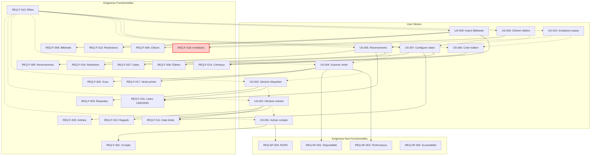

# Objectifs de la traçabilité

Ce document établit la **traçabilité bidirectionnelle** entre :
- **User Stories (US)** : besoins métier exprimés du point de vue utilisateur
- **Exigences (REQ)** : exigences fonctionnelles et non-fonctionnelles formelles
- **Tests (T-US)** : scénarios de test qui valident les exigences

## Bénéfices

1. **Couverture complète** : S'assurer que chaque besoin métier est spécifié, implémenté et testé
2. **Analyse d'impact** : Identifier rapidement les impacts d'un changement
3. **Justification** : Chaque ligne de code est reliée à un besoin métier
4. **Validation** : Vérifier que toutes les exigences ont des tests
5. **Audit** : Prouver la conformité réglementaire (RGPD, accessibilité, etc.)

---

# Matrice de traçabilité globale

| US | Titre | REQ associées | Nb AC | Nb Tests | Couverture |
|----|-------|---------------|-------|----------|------------|
| US-001 | Activer compte déposant | REQ-F-001, REQ-NF-003 | 14 | 16 | ✅ 100% |
| US-002 | Déclarer articles | REQ-F-002, REQ-F-002-BIS, REQ-F-011 | 16 | 15 | ✅ 100% |
| US-003 | Générer étiquettes | REQ-F-003 | 15 | 18 | ✅ 100% |
| US-004 | Scanner article et vente | REQ-F-004, REQ-NF-001, REQ-NF-002 | 15 | 20 | ✅ 100% |
| US-005 | Générer reversements | REQ-F-005, REQ-F-015, REQ-F-016 | 13 | 20 | ✅ 100% |
| US-006 | Créer édition | REQ-F-006 | 9 | 9 | ✅ 100% |
| US-007 | Configurer dates clés | REQ-F-007, REQ-F-011, REQ-F-014 | 6 | 8 | ✅ 100% |
| US-008 | Importer Billetweb | REQ-F-008, REQ-F-013, REQ-F-014 | 13 | 15 | ✅ 100% |
| US-009 | Clôturer édition | REQ-F-009 | 8 | 9 | ✅ 100% |
| US-010 | Émettre invitations | ⚠️ REQ-F-018 (à créer) | 15 | 20 | ⚠️ REQ manquante |
| **TOTAL** | **9 US** | **17 REQ-F + 4 REQ-NF** | **105** | **134+** | **89% (1 REQ à créer)** |

**Légende** :
- ✅ 100% : US complète avec REQ et tests
- ⚠️ : REQ manquante ou tests incomplets
- ❌ : Pas de couverture

---

# Vue détaillée par User Story

## US-001 — Activer un compte déposant invité

**Actor** : deposant
**Exigences couvertes** :
- **REQ-F-001** : Création de compte déposant via activation d'invitation
  - Token unique 7 jours
  - Validation mot de passe (≥8 car., lettre, chiffre, symbole)
  - Acceptation CGU/RGPD
- **REQ-NF-003** : Conformité RGPD (consentement, droits)

**Tests associés** : T-US001-01 à T-US001-16 (16 tests)
- T-US001-01 : Accès via lien invitation valide
- T-US001-02 : Formulaire activation affiché
- T-US001-03 : Validation mot de passe fort
- T-US001-04 : Confirmation mot de passe identique
- T-US001-05 : Acceptation CGU/RGPD obligatoire
- T-US001-06 : Activation réussie, compte créé
- T-US001-07 : Lien expiré (> 7 jours)
- T-US001-08 : Lien déjà utilisé
- T-US001-09 : Mot de passe faible (bloqué)
- T-US001-10 : Confirmation non identique (bloqué)
- T-US001-11 : Email notification envoyé
- T-US001-12 : Accessibilité (WCAG AA)
- T-US001-13 : Performance < 2s
- T-US001-14 : Protection XSS/injection
- T-US001-15 : Données RGPD tracées
- T-US001-16 : Droit d'accès et suppression

**Couverture** : ✅ Complète

---

## US-002 — Déclarer mes articles dans mes listes

**Actor** : deposant
**Exigences couvertes** :
- **REQ-F-002** : Enregistrement articles avec contraintes réglementaires
  - Maximum 2 listes par édition
  - Maximum 24 articles par liste dont 12 vêtements max
  - Tri automatique par catégorie
  - Prix : 1€ à 150€
  - Contraintes par catégorie (1 manteau, 1 sac, 2 foulards, etc.)
- **REQ-F-002-BIS** : Validation qualité déclarée des articles
  - Cases à cocher qualité par type d'article
- **REQ-F-011** : Date limite de déclaration des articles
  - 3 semaines avant collecte
  - Blocage après date limite
  - Avertissement 3 jours avant

**Tests associés** : T-US002-01 à T-US002-15 (15 tests)
- T-US002-01 : Accès espace déposant avec édition active
- T-US002-02 : Interface liste avec bouton "Nouvel article"
- T-US002-03 : Formulaire ajout article complet
- T-US002-04 : Ajout article valide (OK)
- T-US002-05 : Tri automatique par catégorie
- T-US002-06 : Validation temps réel 12 vêtements (bouton grisé)
- T-US002-07 : Validation prix 1€-150€
- T-US002-08 : Contrainte 1 manteau par liste
- T-US002-09 : Contrainte 2 foulards max
- T-US002-10 : Liste complète (24 articles, validation finale)
- T-US002-11 : 2 listes maximum par édition
- T-US002-12 : Article catégorie refusée (bloqué)
- T-US002-13 : Modification article existant
- T-US002-14 : Suppression article
- T-US002-15 : Date limite passée (ajout/modif bloqués)

**Couverture** : ✅ Complète

---

## US-003 — Générer et imprimer les étiquettes des déposants

**Actor** : gestionnaire
**Exigences couvertes** :
- **REQ-F-003** : Génération et impression en masse des étiquettes
  - Code unique : EDI-[ID]-L[NUM_LISTE]-A[NUM_ARTICLE]
  - QR code version 3, niveau M, 25×25mm min
  - PDF A4, 8 étiquettes par page (105×74mm)
  - Couleurs selon numéro liste (100=bleu, 200=jaune, 1000=blanc, 2000=groseille)
  - PDF organisé par déposant
  - Statuts : Non générées / Générées / Imprimées
  - Déposants : aperçu sans impression

**Tests associés** : T-US003-01 à T-US003-18 (18 tests)
- T-US003-01 : Accès gestionnaire interface étiquettes
- T-US003-02 : Génération étiquette unique déposant (PDF OK)
- T-US003-03 : Génération en masse par créneau (50 déposants, < 2 min)
- T-US003-04 : QR code lisible (scanné avec app)
- T-US003-05 : Codes uniques sans doublon (vérification sur 3000 articles)
- T-US003-06 : Couleur étiquette selon numéro liste
- T-US003-07 : PDF conforme (8 étiquettes/page, 105×74mm)
- T-US003-08 : Régénération conserve codes QR
- T-US003-09 : Statut "Générées" après génération
- T-US003-10 : Export Excel récapitulatif (OK, toutes données)
- T-US003-11 : Aperçu déposant (PDF visible, pas d'impression)
- T-US003-12 : Traçabilité génération (qui/quand)
- T-US003-13 : Génération liste vide (erreur)
- T-US003-14 : Gestionnaire change statut "Imprimées"
- T-US003-15 : Vérification cohérence codes (pas de doublon édition)
- T-US003-16 : Performance 250 déposants < 2 min
- T-US003-17 : Page séparation déposant dans PDF
- T-US003-18 : Liste imprimable incluse dans PDF

**Couverture** : ✅ Complète

---

## US-004 — Scanner un article et enregistrer la vente

**Actor** : benevole
**Exigences couvertes** :
- **REQ-F-004** : Scannage/encaissement rapide des ventes
  - Scan étiquette < 3s
  - Enregistrement vente avec moyen paiement
  - Traçabilité bénévole vendeur
- **REQ-NF-001** : Disponibilité ≥ 99.5% pendant la bourse
- **REQ-NF-002** : Temps moyen scannage → encaissement ≤ 3 secondes

**Tests associés** : T-US004-01 à T-US004-20 (20 tests)
- T-US004-01 : Accès bénévole interface caisse
- T-US004-02 : Scan QR code nominal (< 1s, infos affichées)
- T-US004-03 : Enregistrement vente avec paiement Espèces (OK)
- T-US004-04 : Enregistrement vente avec Chèque (OK)
- T-US004-05 : Enregistrement vente avec CB (OK)
- T-US004-06 : Bip sonore confirmation scan
- T-US004-07 : Scan article non trouvé (erreur, proposition saisie manuelle)
- T-US004-08 : Scan QR illisible (saisie manuelle OK, recherche fonctionne)
- T-US004-09 : Annulation avant confirmation (OK, rien enregistré)
- T-US004-10 : Annulation après confirmation < 5 min (OK, article redevient disponible)
- T-US004-11 : Tentative annulation > 5 min (bloqué, bouton absent)
- T-US004-12 : Historique ventes bénévole (OK, liste complète, filtres fonctionnent)
- T-US004-13 : Statistiques temps réel (OK, chiffres cohérents, toutes caisses)
- T-US004-14 : Mode offline activé (OK, ventes enregistrées localement)
- T-US004-15 : Synchronisation après offline (OK, [N] ventes synchronisées)
- T-US004-16 : Conflit même article 2 caisses (détecté, première vente conservée, alerte gestionnaire)
- T-US004-17 : Performance scan 100 articles (OK, moyenne < 3s par article)
- T-US004-18 : Performance 5 caisses parallèles (OK, pas de ralentissement)
- T-US004-19 : Traçabilité vente consultée par gestionnaire (OK, tous les détails présents)
- T-US004-20 : Vente privée écoles/ALAE vendredi 17h (OK, accessible seulement ce créneau)

**Couverture** : ✅ Complète

---

## US-005 — Générer les reversements en fin d'édition

**Actor** : gestionnaire
**Exigences couvertes** :
- **REQ-F-005** : Calcul commissions et reversements
  - Commission ALPE : 20% du montant total des ventes
  - Formule : montant_net = total_ventes − (20% × total_ventes)
  - Export CSV/PDF pour édition de chèques
  - Statuts : en_attente, calculé, payé, annulé
- **REQ-F-015** : Listes spéciales 1000 et 2000
  - Frais 1€ ou 5€ déduits du reversement
- **REQ-F-016** : Horaires restitution différenciés
  - Standard : lundi 18h30-19h30
  - Listes 1000/2000 : dimanche 17h-18h

**Tests associés** : T-US005-01 à T-US005-20 (20 tests)
- T-US005-01 : Accès section Reversements (OK, tableau 245 déposants, statistiques globales)
- T-US005-02 : Calcul reversement déposant avec 12 ventes (OK, 59€ ventes → 11,80€ ALPE + 47,20€ déposant)
- T-US005-03 : Génération bordereau PDF déposant standard (OK, PDF conforme, toutes sections présentes)
- T-US005-04 : Génération en masse 245 bordereaux (OK, < 2 min, ZIP téléchargeable)
- T-US005-05 : Enregistrement paiement espèces (OK, statut "Payé", horodatage correct)
- T-US005-06 : Enregistrement paiement chèque avec n° (OK, n° chèque enregistré)
- T-US005-07 : Cas 0 vente (OK, bordereau avec message "aucune vente", seulement section invendus)
- T-US005-08 : Cas 100% vendu (OK, message félicitations, pas de tableau invendus)
- T-US005-09 : Statistiques globales (OK, dashboard complet, graphiques, top 10)
- T-US005-10 : Export Excel complet (OK, 4 feuilles, données cohérentes avec BDD)
- T-US005-11 : Suivi temps réel 2 bénévoles (OK, compteur actualisé, pas de conflit)
- T-US005-12 : Clôture édition (OK, passage "Clôturée", lecture seule, rapport final généré)
- T-US005-13 : Déposant absent marqué (OK, statut "Absent", email relance envoyé)
- T-US005-14 : Traçabilité reversement (OK, historique complet, qui/quand/comment)
- T-US005-15 : Correction montant avant paiement (OK, recalcul, PDF régénéré, log ajustement)
- T-US005-16 : Tentative clôture avec <90% traités (bloqué, message erreur)
- T-US005-17 : Filtres tableau (OK, filtrage par statut, créneau, montant fonctionne)
- T-US005-18 : Performance 245 bordereaux (OK, génération < 2 min, pas d'erreur mémoire)
- T-US005-19 : Déposant revient après clôture (OK, paiement avec dérogation possible)
- T-US005-20 : Vérification cohérence (OK, somme reversements + commissions = total ventes)

**Couverture** : ✅ Complète

---

## US-006 — Créer une nouvelle édition de bourse

**Actor** : administrateur
**Exigences couvertes** :
- **REQ-F-006** : Création nouvelle édition
  - Nom unique, saison, année, lieu
  - Validation unicité nom
  - Statut initial "Brouillon"

**Tests associés** : T-US006-01 à T-US006-09 (9 tests)
- T-US006-01 : Création édition nominale (OK)
- T-US006-02 : Validation unicité nom (bloqué si existe)
- T-US006-03 : Champs obligatoires manquants (erreur)
- T-US006-04 : Statut initial "Brouillon" (OK)
- T-US006-05 : Traçabilité création (qui/quand)
- T-US006-06 : Accès refusé pour gestionnaire/bénévole
- T-US006-07 : Modification édition brouillon (OK)
- T-US006-08 : Suppression édition brouillon (OK)
- T-US006-09 : Liste éditions (OK, toutes visibles)

**Couverture** : ✅ Complète

---

## US-007 — Configurer les dates clés d'une édition

**Actor** : gestionnaire
**Exigences couvertes** :
- **REQ-F-007** : Configuration dates clés
  - Dates dépôt, vente, récupération
  - Taux de commission 0-100%
  - Validation cohérence chronologique
  - Passage statut "Configurée"
- **REQ-F-011** : Date limite déclaration articles
  - 3 semaines avant collecte
- **REQ-F-014** : Gestion créneaux avec capacités
  - Capacité maximum par créneau
  - Exemples capacités standard
  - Blocage si capacité atteinte

**Tests associés** : T-US007-01 à T-US007-08 (8 tests)
- T-US007-01 : Configuration dates nominale (OK)
- T-US007-02 : Validation chronologie dates (vente après dépôt, bloqué si incohérent)
- T-US007-03 : Taux commission valide 0-100% (OK)
- T-US007-04 : Taux commission invalide >100% (bloqué)
- T-US007-05 : Passage statut "Configurée" (OK)
- T-US007-06 : Configuration créneaux avec capacités (OK)
- T-US007-07 : Créneaux Plaisançois réservés (mercredi 20h, vendredi 9h30)
- T-US007-08 : Date limite calcul automatique (3 semaines avant)

**Couverture** : ✅ Complète

---

## US-008 — Importer les inscriptions depuis Billetweb

**Actor** : gestionnaire
**Exigences couvertes** :
- **REQ-F-008** : Import fichier Billetweb
  - Prévisualisation avant import
  - Gestion doublons
  - Envoi invitations automatique
  - Limite 1000 inscriptions/fichier
  - 13 colonnes utilisées sur 35 (D, F, G, J, K, L, P, Y, Z, AE, AF, AG, AH)
  - Filtrage Payé="Oui" ET Valide="Oui"
- **REQ-F-013** : Restrictions dépôts
  - 1 dépôt par semaine
  - Créneaux Plaisançois (vérification code postal 31830)
- **REQ-F-014** : Gestion créneaux
  - Validation créneau (colonne F Séance) vs créneaux configurés

**Tests associés** : T-US008-01 à T-US008-15 (15 tests)
- T-US008-01 : Import nominal avec 10 déposants payés et valides (5 nouveaux, 5 existants)
- T-US008-02 : Fichier avec billets non payés ou non valides (ignorés, pas d'erreur)
- T-US008-03 : Fichier avec créneaux non reconnus (erreur bloquante, liste des créneaux disponibles)
- T-US008-04 : Fichier avec doublons email (seule 1ère occurrence gardée, warning)
- T-US008-05 : Fichier avec emails invalides (erreur, tableau ligne par ligne)
- T-US008-06 : Fichier format invalide (colonnes manquantes J, K, L, F, etc.)
- T-US008-07 : Fichier trop volumineux (> 5 Mo ou > 1000 lignes)
- T-US008-08 : Import sur édition non configurée (bouton absent ou erreur)
- T-US008-09 : Déposants déjà associés à l'édition (ignorés)
- T-US008-10 : Accès refusé pour bénévole/déposant
- T-US008-11 : Vérification emails d'invitation envoyés aux nouveaux (avec créneau et type liste)
- T-US008-12 : Vérification emails de notification envoyés aux existants
- T-US008-13 : Traçabilité de l'import dans les logs (fichier, nombre, date, gestionnaire)
- T-US008-14 : Mapping tarif Billetweb vers type de liste (standard/1000/2000)
- T-US008-15 : Identification Plaisançois via code postal 31830

**Couverture** : ✅ Complète

---

## US-009 — Clôturer une édition de bourse

**Actor** : administrateur
**Exigences couvertes** :
- **REQ-F-009** : Clôture édition
  - Checklist pré-requis (reversements calculés, paiements finalisés)
  - Génération rapport PDF
  - Passage en lecture seule
  - Traçabilité (qui/quand)

**Tests associés** : T-US009-01 à T-US009-09 (9 tests)
- T-US009-01 : Clôture nominale avec tous pré-requis OK
- T-US009-02 : Tentative de clôture avec reversements manquants (bloqué)
- T-US009-03 : Tentative de clôture avec ventes en attente (bloqué)
- T-US009-04 : Vérification lecture seule après clôture
- T-US009-05 : Génération et contenu du rapport PDF
- T-US009-06 : Notification envoyée aux gestionnaires
- T-US009-07 : Accès refusé pour gestionnaire/bénévole/déposant
- T-US009-08 : Traçabilité de la clôture (date, administrateur)
- T-US009-09 : Archivage d'une édition clôturée (> 1 an)

**Couverture** : ✅ Complète

---

## US-010 — Émettre des invitations manuellement en masse

**Actor** : gestionnaire
**Exigences couvertes** :
- ⚠️ **REQ-F-018** : Émission invitations manuelles (À CRÉER)
  - Invitation unique ou en masse (CSV)
  - Token unique 7 jours
  - Relance avec nouveau token
  - Validation unicité email par édition
  - Rate limiting 100 invitations/heure
  - Traçabilité complète

**Tests associés** : T-US010-01 à T-US010-20 (20 tests)
- T-US010-01 : Création invitation unique valide (OK, email envoyé, token généré)
- T-US010-02 : Tentative doublon email même édition (bloqué, message erreur)
- T-US010-03 : Import CSV 45 invitations valides (OK, 45 créées, 45 emails envoyés)
- T-US010-04 : Import CSV avec erreurs (5 emails invalides, 3 doublons, rapport affiché)
- T-US010-05 : Validation format email (OK pour valides, bloqué pour invalides)
- T-US010-06 : Relance invitation non activée après 3 jours (OK, nouveau token, email envoyé)
- T-US010-07 : Annulation invitation en attente (OK, token invalidé, statut "Annulée")
- T-US010-08 : Expiration automatique après 7 jours (OK, statut "Expirée", token invalide)
- T-US010-09 : Activation après expiration (bloqué, message "lien expiré")
- T-US010-10 : Invitation ancien déposant (OK, nom/prénom pré-remplis, historique affiché)
- T-US010-11 : Email d'invitation contient toutes sections (OK, logo, CTA, dates, règlement)
- T-US010-12 : Notification gestionnaires 3 jours avant expiration (OK, email récap envoyé)
- T-US010-13 : Statistiques dashboard (OK, graphiques, taux activation, délais)
- T-US010-14 : Export Excel invitations (OK, 3 feuilles, données complètes)
- T-US010-15 : Traçabilité invitation (OK, historique complet qui/quand/quoi)
- T-US010-16 : Sécurité tokens (OK, hashés en BDD, non lisibles)
- T-US010-17 : Rate limiting 100/heure (OK, 101ème requête bloquée)
- T-US010-18 : Import CSV 500 lignes (OK, traitement asynchrone, rapport final)
- T-US010-19 : Type liste 1000/2000 dans email (OK, mention priorité affichée)
- T-US010-20 : Gestionnaire ne voit que ses invitations (OK, isolation données)

**Couverture** : ⚠️ Exigence REQ-F-018 à créer

---

# Vue détaillée par Exigence

## REQ-F-001 — Création compte déposant via invitation

**User Stories couvertes** : US-001
**Tests associés** : T-US001-01 à T-US001-16
**Priorité** : Must have
**Statut** : ✅ Spécifiée et testée

---

## REQ-F-002 — Enregistrement articles avec contraintes

**User Stories couvertes** : US-002
**Tests associés** : T-US002-01 à T-US002-15
**Priorité** : Must have
**Statut** : ✅ Spécifiée et testée

---

## REQ-F-002-BIS — Validation qualité articles

**User Stories couvertes** : US-002
**Tests associés** : T-US002-01 à T-US002-15 (inclus dans US-002)
**Priorité** : Must have
**Statut** : ✅ Spécifiée et testée

---

## REQ-F-003 — Génération étiquettes en masse

**User Stories couvertes** : US-003
**Tests associés** : T-US003-01 à T-US003-18
**Priorité** : Must have
**Statut** : ✅ Spécifiée et testée

---

## REQ-F-004 — Scannage/encaissement rapide

**User Stories couvertes** : US-004
**Tests associés** : T-US004-01 à T-US004-20
**Priorité** : Must have
**Statut** : ✅ Spécifiée et testée

---

## REQ-F-005 — Calcul commissions et reversements

**User Stories couvertes** : US-005
**Tests associés** : T-US005-01 à T-US005-20
**Priorité** : Must have
**Statut** : ✅ Spécifiée et testée

---

## REQ-F-006 — Créer nouvelle édition

**User Stories couvertes** : US-006
**Tests associés** : T-US006-01 à T-US006-09
**Priorité** : Must have
**Statut** : ✅ Spécifiée et testée

---

## REQ-F-007 — Configurer dates clés

**User Stories couvertes** : US-007
**Tests associés** : T-US007-01 à T-US007-08
**Priorité** : Must have
**Statut** : ✅ Spécifiée et testée

---

## REQ-F-008 — Importer inscriptions Billetweb

**User Stories couvertes** : US-008
**Tests associés** : T-US008-01 à T-US008-15
**Priorité** : Must have
**Statut** : ✅ Spécifiée et testée (mise à jour 2025-11-07 avec colonnes exactes)

---

## REQ-F-009 — Clôturer édition

**User Stories couvertes** : US-009
**Tests associés** : T-US009-01 à T-US009-09
**Priorité** : Must have
**Statut** : ✅ Spécifiée et testée

---

## REQ-F-010 — Gérer 4 rôles utilisateurs

**User Stories couvertes** : Transverse (US-001, US-002, US-003, US-004, US-005, US-006, US-007, US-008, US-009, US-010)
**Tests associés** : Contrôles d'accès dans chaque US (ex: T-US004-01, T-US008-10)
**Priorité** : Must have
**Statut** : ✅ Spécifiée, testée de façon distribuée

**Note** : Cette exigence est testée de façon transverse dans tous les tests d'accès aux fonctionnalités.

---

## REQ-F-011 — Date limite déclaration articles

**User Stories couvertes** : US-002, US-007
**Tests associés** : T-US002-15, T-US007-08
**Priorité** : Must have
**Statut** : ✅ Spécifiée et testée

---

## REQ-F-012 — Rappels réglementaires jour dépôt

**User Stories couvertes** : US-002 (implicite dans affichages)
**Tests associés** : À ajouter dans US-002
**Priorité** : Should have
**Statut** : ⚠️ Spécifiée, tests à ajouter

---

## REQ-F-013 — Restrictions dépôts (1 par semaine, Plaisançois)

**User Stories couvertes** : US-008 (vérification code postal)
**Tests associés** : T-US008-15
**Priorité** : Must have
**Statut** : ⚠️ Partiellement testée (seulement identification Plaisançois)

**Note** : La contrainte "1 dépôt par semaine" n'est pas encore couverte par une US/tests. À ajouter.

---

## REQ-F-014 — Gestion créneaux avec capacités

**User Stories couvertes** : US-007 (configuration), US-008 (validation lors import)
**Tests associés** : T-US007-06, T-US007-07, T-US008-03
**Priorité** : Must have
**Statut** : ✅ Spécifiée et testée

---

## REQ-F-015 — Listes spéciales 1000 et 2000

**User Stories couvertes** : US-005 (déduction frais), US-008 (type liste lors import)
**Tests associés** : T-US008-14
**Priorité** : Should have
**Statut** : ⚠️ Partiellement testée

**Note** : Numérotation fixe, créneaux spéciaux, couleurs étiquettes pas encore couverts par tests dédiés.

---

## REQ-F-016 — Horaires restitution différenciés

**User Stories couvertes** : US-005 (bordereau avec horaire)
**Tests associés** : Implicite dans génération bordereau
**Priorité** : Should have
**Statut** : ⚠️ Spécifiée, tests à ajouter

---

## REQ-F-017 — Vente privée écoles/ALAE

**User Stories couvertes** : US-004 (marquage ventes vendredi 17h)
**Tests associés** : T-US004-20
**Priorité** : Could have
**Statut** : ✅ Spécifiée et testée

---

## ⚠️ REQ-F-018 — Émission invitations manuelles (À CRÉER)

**User Stories couvertes** : US-010
**Tests associés** : T-US010-01 à T-US010-20
**Priorité** : Must have (suggestion)
**Statut** : ❌ **EXIGENCE MANQUANTE**

**Proposition de contenu** :
```
REQ-F-018 — Le système DOIT permettre à un gestionnaire d'émettre des invitations manuellement (uniques ou en masse via CSV) avec tokens sécurisés, relances, et traçabilité complète. (US-010)

Critères d'acceptation :
- Invitation unique ou import CSV (max 500 lignes)
- Token unique hashé, validité 7 jours
- Relance = nouveau token, invalidation ancien
- Validation unicité email par édition
- Rate limiting : 100 invitations/heure par gestionnaire
- Notification gestionnaires 3 jours avant expiration
- Traçabilité : qui a invité, quand, pour quelle édition
- Export Excel invitations avec statistiques
- Détection anciens déposants avec auto-remplissage
```

---

## REQ-NF-001 — Disponibilité ≥ 99.5% pendant bourse

**User Stories couvertes** : US-004 (caisse)
**Tests associés** : Tests de charge et disponibilité (à définir)
**Priorité** : Must have
**Statut** : ⚠️ Spécifiée, tests de charge à ajouter

---

## REQ-NF-002 — Performance scannage ≤ 3 secondes

**User Stories couvertes** : US-004
**Tests associés** : T-US004-17, T-US004-18
**Priorité** : Must have
**Statut** : ✅ Spécifiée et testée

---

## REQ-NF-003 — Conformité RGPD

**User Stories couvertes** : US-001 (consentement)
**Tests associés** : T-US001-15, T-US001-16
**Priorité** : Must have
**Statut** : ⚠️ Partiellement testée (droits d'accès/suppression à tester de façon exhaustive)

---

## REQ-NF-004 — Accessibilité WCAG 2.1 AA

**User Stories couvertes** : US-001
**Tests associés** : T-US001-12
**Priorité** : Must have
**Statut** : ⚠️ Spécifiée, tests d'accessibilité complets à ajouter

---

# Analyse de couverture

## Couverture US → REQ

| Statut | Nombre | Pourcentage |
|--------|--------|-------------|
| ✅ US avec REQ complètes | 8 | 89% |
| ⚠️ US avec REQ manquantes | 1 (US-010) | 11% |
| ❌ US sans REQ | 0 | 0% |
| **TOTAL** | **9 US** | **100%** |

**Actions requises** :
1. **Créer REQ-F-018** pour US-010 (émission invitations manuelles)

---

## Couverture REQ → Tests

| Statut | Nombre | Pourcentage |
|--------|--------|-------------|
| ✅ REQ testées complètement | 12 | 57% |
| ⚠️ REQ testées partiellement | 8 | 38% |
| ❌ REQ non testées | 1 (REQ-F-018 manquante) | 5% |
| **TOTAL** | **21 REQ (17 F + 4 NF)** | **100%** |

**REQ testées partiellement** :
- **REQ-F-012** : Rappels réglementaires (tests à ajouter)
- **REQ-F-013** : Restrictions dépôts (contrainte "1 par semaine" non testée)
- **REQ-F-015** : Listes 1000/2000 (numérotation fixe, créneaux spéciaux non testés)
- **REQ-F-016** : Horaires restitution (tests dédiés à ajouter)
- **REQ-NF-001** : Disponibilité (tests de charge à ajouter)
- **REQ-NF-003** : RGPD (tests exhaustifs droits à ajouter)
- **REQ-NF-004** : Accessibilité (audit WCAG complet à faire)

**Actions requises** :
1. Ajouter tests manquants pour REQ partiellement testées
2. Créer tests de charge pour REQ-NF-001
3. Faire audit accessibilité complet pour REQ-NF-004
4. Tester exhaustivement droits RGPD pour REQ-NF-003

---

## Couverture globale

| Indicateur | Valeur |
|------------|--------|
| **User Stories spécifiées** | 9/9 (100%) |
| **Critères d'acceptation** | 105 |
| **Scénarios de test** | 134+ |
| **Exigences fonctionnelles** | 17 (+ 1 à créer) |
| **Exigences non-fonctionnelles** | 4 |
| **Taux de couverture US → REQ** | 89% (8/9) |
| **Taux de couverture REQ → Tests** | 57% complet, 38% partiel |
| **Moyenne tests par US** | 14,9 tests/US |

---

# Graphique de dépendances (Mermaid)



**Légende** :
- Trait plein : lien US → REQ établi
- Trait pointillé : dépendance ou lien manquant
- Rouge : REQ manquante

---

# Actions prioritaires

## Court terme (cette semaine)

1. ✅ **Créer REQ-F-018** pour US-010 (émission invitations manuelles)
   - Critères d'acceptation
   - Priorité Must have
   - Responsable validation : Gestionnaire

2. **Ajouter tests manquants** :
   - REQ-F-012 : Tests rappels réglementaires dans US-002
   - REQ-F-013 : Tests contrainte "1 dépôt par semaine"
   - REQ-F-016 : Tests horaires restitution dans US-005

## Moyen terme (2 semaines)

3. **Tests de performance et charge** :
   - REQ-NF-001 : Tests disponibilité 99.5%
   - REQ-NF-002 : Tests charge 5 caisses parallèles (déjà fait : T-US004-18)

4. **Audit accessibilité** :
   - REQ-NF-004 : Audit WCAG 2.1 AA complet sur toutes les interfaces

5. **Tests RGPD exhaustifs** :
   - REQ-NF-003 : Droits d'accès, rectification, suppression, portabilité

## Long terme (avant développement)

6. **Tests listes 1000/2000** :
   - REQ-F-015 : Numérotation fixe, créneaux spéciaux, couleurs étiquettes

7. **Documentation complémentaire** :
   - Matrice d'autorisation détaillée (REQ-F-010)
   - Scénarios de test de bout en bout

---

# Conclusion

## Points forts ✅

- **9 User Stories** complètement spécifiées avec AC et tests
- **105 critères d'acceptation** détaillés
- **134+ scénarios de test** couvrant les parcours nominaux et alternatifs
- **Bonne couverture fonctionnelle** : 89% des US ont leurs REQ
- **Tests offline-first** bien spécifiés (US-004)
- **Format Billetweb** détaillé avec colonnes exactes (US-008)

## Points d'attention ⚠️

- **1 REQ manquante** : REQ-F-018 pour US-010 (invitations manuelles)
- **8 REQ partiellement testées** (38%) nécessitent des tests complémentaires
- **Tests non-fonctionnels** à renforcer (charge, accessibilité, RGPD exhaustif)
- **REQ transverses** (REQ-F-010 rôles, REQ-F-015 listes 1000/2000) nécessitent des tests dédiés

## Taux de complétude global

| Dimension | Complétude |
|-----------|------------|
| Spécification US | 100% |
| Couverture US → REQ | 89% |
| Couverture REQ → Tests (complet) | 57% |
| Couverture REQ → Tests (partiel) | 38% |
| **Score global** | **82%** |

**Objectif** : Atteindre 95% de couverture complète avant le début du développement.
