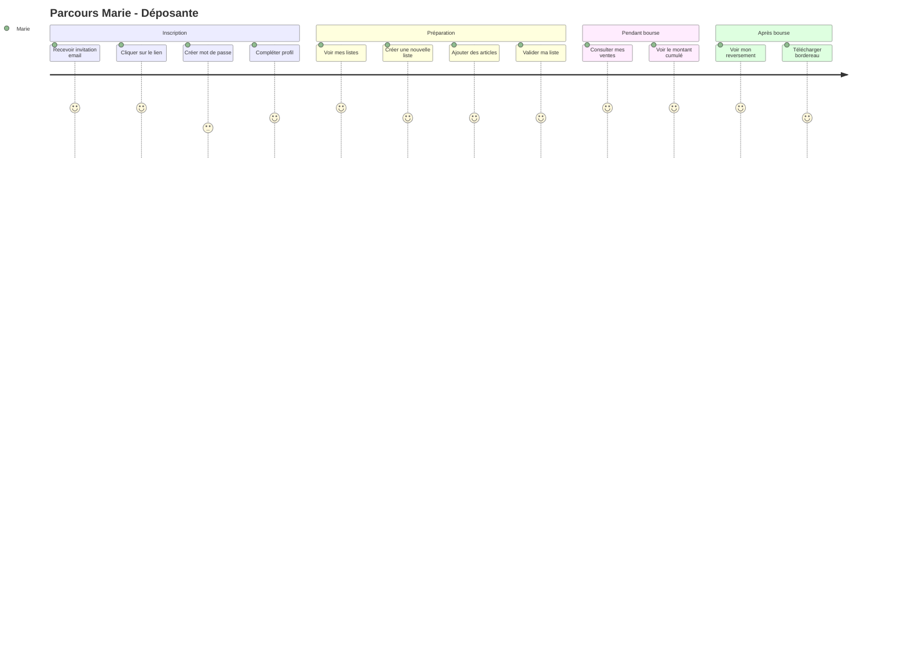
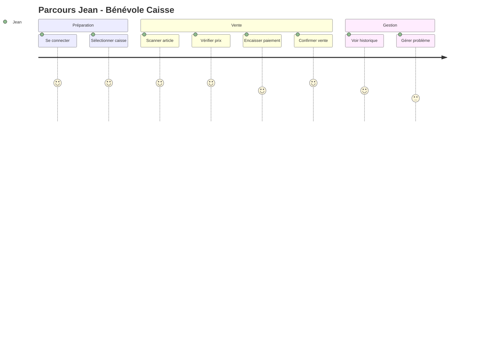
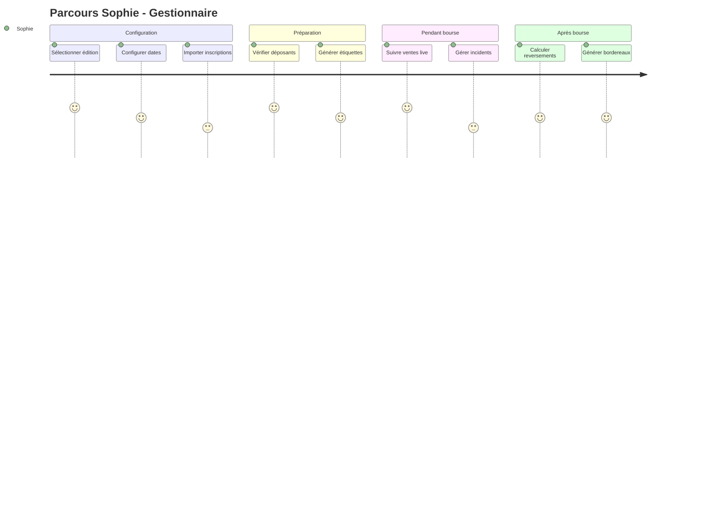

# 1. Vue d'ensemble

Ce document décrit les parcours utilisateur et les wireframes basse fidélité pour les 4 profils de l'application :
- **Déposant** : Marie, 35 ans, gère ses articles et suit ses ventes
- **Bénévole** : Jean, 58 ans, opère les caisses pendant la bourse
- **Gestionnaire** : Sophie, 42 ans, configure et pilote les éditions
- **Administrateur** : Pierre, 50 ans, gestion globale du système

---

# 2. Architecture de navigation

## 2.1 Structure globale

```
┌─────────────────────────────────────────────────────────────────┐
│  HEADER                                                          │
│  ┌─────────┐  ┌─────────────────────────────┐  ┌──────────────┐ │
│  │  Logo   │  │    Titre / Édition active   │  │ Profil/Menu  │ │
│  └─────────┘  └─────────────────────────────┘  └──────────────┘ │
├─────────────────────────────────────────────────────────────────┤
│                                                                  │
│  CONTENU PRINCIPAL                                               │
│                                                                  │
│  (adapté selon le rôle et la page)                              │
│                                                                  │
│                                                                  │
│                                                                  │
├─────────────────────────────────────────────────────────────────┤
│  NAVIGATION (mobile = bottom bar / desktop = sidebar)           │
│  ┌────────┐  ┌────────┐  ┌────────┐  ┌────────┐                │
│  │ Accueil│  │ Listes │  │ Ventes │  │ Profil │                │
│  └────────┘  └────────┘  └────────┘  └────────┘                │
└─────────────────────────────────────────────────────────────────┘
```

## 2.2 Navigation par rôle

| Rôle | Onglets disponibles |
|------|---------------------|
| Déposant | Accueil, Mes Listes, Mes Ventes, Profil |
| Bénévole | Accueil, Caisse, Ventes, Profil |
| Gestionnaire | Accueil, Éditions, Déposants, Étiquettes, Stats, Profil |
| Admin | Tout + Utilisateurs, Paramètres |

---

# 3. Parcours Déposant (Marie)

## 3.1 User Journey



## 3.2 Wireframes Déposant

### Page d'accueil (après connexion)

```
┌─────────────────────────────────────────────────────────────────┐
│  🏠 Accueil                                    [Marie ▼]        │
├─────────────────────────────────────────────────────────────────┤
│                                                                  │
│  ┌─────────────────────────────────────────────────────────┐   │
│  │  BOURSE PRINTEMPS 2025                                   │   │
│  │  📅 Dépôt : 15-17 mars | Vente : 22-23 mars              │   │
│  │  ⏰ Date limite déclaration : 24 février                 │   │
│  └─────────────────────────────────────────────────────────┘   │
│                                                                  │
│  ┌─────────────────────────┐  ┌─────────────────────────┐      │
│  │  📦 MES LISTES          │  │  💰 MES VENTES          │      │
│  │                         │  │                         │      │
│  │  2 listes créées        │  │  12 articles vendus     │      │
│  │  45 articles déclarés   │  │  87,50 € total          │      │
│  │                         │  │                         │      │
│  │  [Voir mes listes →]    │  │  [Voir détails →]       │      │
│  └─────────────────────────┘  └─────────────────────────┘      │
│                                                                  │
│  ┌─────────────────────────────────────────────────────────┐   │
│  │  📢 NOTIFICATIONS                                        │   │
│  │  • Votre liste n°245 a été validée                       │   │
│  │  • 3 nouveaux articles vendus aujourd'hui                │   │
│  └─────────────────────────────────────────────────────────┘   │
│                                                                  │
└─────────────────────────────────────────────────────────────────┘
```

### Mes Listes

```
┌─────────────────────────────────────────────────────────────────┐
│  📦 Mes Listes                                [+ Nouvelle liste]│
├─────────────────────────────────────────────────────────────────┤
│                                                                  │
│  ┌─────────────────────────────────────────────────────────┐   │
│  │  LISTE N°245                           🟢 Validée        │   │
│  │  ─────────────────────────────────────────────────────── │   │
│  │  📊 24/24 articles  |  👕 12 vêtements  |  💶 312,00 €   │   │
│  │                                                          │   │
│  │  [Voir articles]  [📄 Étiquettes PDF]                    │   │
│  └─────────────────────────────────────────────────────────┘   │
│                                                                  │
│  ┌─────────────────────────────────────────────────────────┐   │
│  │  LISTE N°246                           🟡 Brouillon      │   │
│  │  ─────────────────────────────────────────────────────── │   │
│  │  📊 18/24 articles  |  👕 8 vêtements   |  💶 156,00 €   │   │
│  │                                                          │   │
│  │  [Modifier]  [Valider la liste]                          │   │
│  └─────────────────────────────────────────────────────────┘   │
│                                                                  │
│  ┌─────────────────────────────────────────────────────────┐   │
│  │  ℹ️ Vous pouvez créer jusqu'à 2 listes par édition.      │   │
│  │     Chaque liste peut contenir 24 articles max.          │   │
│  └─────────────────────────────────────────────────────────┘   │
│                                                                  │
└─────────────────────────────────────────────────────────────────┘
```

### Édition d'une liste (ajout articles)

```
┌─────────────────────────────────────────────────────────────────┐
│  ← Retour    LISTE N°246 (Brouillon)        [Valider la liste] │
├─────────────────────────────────────────────────────────────────┤
│                                                                  │
│  VÊTEMENTS (lignes 1-12)                      8/12 utilisées    │
│  ┌─────────────────────────────────────────────────────────┐   │
│  │ # │ Description              │ Taille │ Prix  │ Actions │   │
│  ├───┼──────────────────────────┼────────┼───────┼─────────┤   │
│  │ 1 │ Pantalon jean bleu       │ 6 ans  │ 8,00€ │ ✏️ 🗑️ 📋│   │
│  │ 2 │ T-shirt rouge dinosaure  │ 4 ans  │ 3,00€ │ ✏️ 🗑️ 📋│   │
│  │ 3 │ Robe fleurie été         │ 5 ans  │ 12,00€│ ✏️ 🗑️ 📋│   │
│  │...│ ...                      │ ...    │ ...   │ ...     │   │
│  │ 8 │ Manteau hiver (1 max)    │ 6 ans  │ 25,00€│ ✏️ 🗑️   │   │
│  │ 9 │ [+ Ajouter vêtement]     │        │       │         │   │
│  └─────────────────────────────────────────────────────────┘   │
│                                                                  │
│  AUTRES ARTICLES (lignes 13-24)               10/12 utilisées   │
│  ┌─────────────────────────────────────────────────────────┐   │
│  │ # │ Description              │ Catég. │ Prix  │ Actions │   │
│  ├───┼──────────────────────────┼────────┼───────┼─────────┤   │
│  │13 │ Lot 3 puzzles bois       │ Jouets │ 5,00€ │ ✏️ 🗑️ 📋│   │
│  │14 │ Poussette Chicco         │ Puéri. │ 45,00€│ ✏️ 🗑️   │   │
│  │...│ ...                      │ ...    │ ...   │ ...     │   │
│  │23 │ [+ Ajouter article]      │        │       │         │   │
│  └─────────────────────────────────────────────────────────┘   │
│                                                                  │
│  💶 TOTAL : 156,00 €    Sauvegarde auto ✓                       │
│                                                                  │
└─────────────────────────────────────────────────────────────────┘
```

### Modal ajout/édition article

```
┌─────────────────────────────────────────────────────────────────┐
│                    AJOUTER UN ARTICLE                      [X]  │
├─────────────────────────────────────────────────────────────────┤
│                                                                  │
│  Catégorie *                                                     │
│  ┌─────────────────────────────────────────────────────────┐   │
│  │ Vêtements                                            ▼  │   │
│  └─────────────────────────────────────────────────────────┘   │
│                                                                  │
│  Genre              Taille                                       │
│  ┌───────────────┐  ┌───────────────────────────────────────┐   │
│  │ Mixte      ▼  │  │ 4 ans                              ▼  │   │
│  └───────────────┘  └───────────────────────────────────────┘   │
│                                                                  │
│  Description * (100 car. max)                                    │
│  ┌─────────────────────────────────────────────────────────┐   │
│  │ T-shirt rayé bleu et blanc                              │   │
│  └─────────────────────────────────────────────────────────┘   │
│                                                                  │
│  Prix proposé *                                                  │
│  ┌───────────────┐                                              │
│  │ 5,00 €        │  Min 1€ / Max 150€ (poussettes)             │
│  └───────────────┘                                              │
│                                                                  │
│  ☑️ Je certifie que cet article est propre, en bon état,        │
│     et conforme aux critères d'acceptation de la bourse. *      │
│                                                                  │
│  ┌─────────────────────┐  ┌─────────────────────┐               │
│  │     Annuler         │  │   ✓ Enregistrer     │               │
│  └─────────────────────┘  └─────────────────────┘               │
│                                                                  │
└─────────────────────────────────────────────────────────────────┘
```

### Mes Ventes

```
┌─────────────────────────────────────────────────────────────────┐
│  💰 Mes Ventes - Bourse Printemps 2025                          │
├─────────────────────────────────────────────────────────────────┤
│                                                                  │
│  ┌─────────────────────────────────────────────────────────┐   │
│  │                    RÉCAPITULATIF                         │   │
│  │  ┌─────────────┐  ┌─────────────┐  ┌─────────────┐      │   │
│  │  │  VENDUS     │  │  INVENDUS   │  │  À REVERSER │      │   │
│  │  │    12       │  │    33       │  │   70,00 €   │      │   │
│  │  │  articles   │  │  articles   │  │   (80%)     │      │   │
│  │  └─────────────┘  └─────────────┘  └─────────────┘      │   │
│  │                                                          │   │
│  │  Total ventes : 87,50 €  |  Commission ALPE : 17,50 €   │   │
│  └─────────────────────────────────────────────────────────┘   │
│                                                                  │
│  DÉTAIL DES VENTES                                              │
│  ┌─────────────────────────────────────────────────────────┐   │
│  │ 📅 │ Liste │ Article                      │ Prix        │   │
│  ├────┼───────┼──────────────────────────────┼─────────────┤   │
│  │ 22/03 14:32 │ 245-03 │ Robe fleurie été  │ 12,00 €     │   │
│  │ 22/03 15:10 │ 245-07 │ Pantalon jean     │  8,00 €     │   │
│  │ 22/03 16:45 │ 246-14 │ Poussette Chicco  │ 45,00 €     │   │
│  │ 23/03 10:20 │ 245-01 │ Pull col roulé    │  6,00 €     │   │
│  │ ...         │ ...    │ ...               │ ...         │   │
│  └─────────────────────────────────────────────────────────┘   │
│                                                                  │
│  [📄 Télécharger mon bordereau de reversement]                  │
│                                                                  │
└─────────────────────────────────────────────────────────────────┘
```

### Validation de liste (confirmation)

```
┌─────────────────────────────────────────────────────────────────┐
│                    VALIDER MA LISTE                        [X]  │
├─────────────────────────────────────────────────────────────────┤
│                                                                  │
│  ⚠️ Attention : après validation, votre liste ne pourra         │
│     plus être modifiée.                                         │
│                                                                  │
│  ┌─────────────────────────────────────────────────────────┐   │
│  │  RÉCAPITULATIF LISTE N°246                              │   │
│  │  ───────────────────────────────────────────────────────│   │
│  │  • 18 articles déclarés                                  │   │
│  │  • 8 vêtements + 10 autres articles                      │   │
│  │  • Valeur totale : 156,00 €                              │   │
│  └─────────────────────────────────────────────────────────┘   │
│                                                                  │
│  ☑️ J'ai lu et j'accepte le règlement de la bourse *           │
│                                                                  │
│  ☑️ Je m'engage à :                                             │
│     • Déposer mes articles propres et en bon état               │
│     • Respecter le créneau de dépôt attribué                    │
│     • Récupérer mes invendus aux horaires prévus                │
│                                                                  │
│  ┌─────────────────────┐  ┌─────────────────────┐               │
│  │     Annuler         │  │   ✓ Valider         │               │
│  └─────────────────────┘  └─────────────────────┘               │
│                                                                  │
│  📧 Un récapitulatif vous sera envoyé par email.                │
│                                                                  │
└─────────────────────────────────────────────────────────────────┘
```

---

# 4. Parcours Bénévole - Caisse (Jean)

## 4.1 User Journey



## 4.2 Wireframes Caisse

### Écran principal de caisse

```
┌─────────────────────────────────────────────────────────────────┐
│  🏪 CAISSE N°2                    Jean D.  |  🔴 EN LIGNE       │
├─────────────────────────────────────────────────────────────────┤
│                                                                  │
│  ┌─────────────────────────────────────────────────────────┐   │
│  │                                                          │   │
│  │     📷  SCANNER UN ARTICLE                               │   │
│  │                                                          │   │
│  │     ┌───────────────────────────────────────────┐       │   │
│  │     │                                           │       │   │
│  │     │        [Zone de scan caméra]              │       │   │
│  │     │                                           │       │   │
│  │     │         ou saisie manuelle :              │       │   │
│  │     │     ┌─────────────────────────┐           │       │   │
│  │     │     │ BP2025-L245-A03         │           │       │   │
│  │     │     └─────────────────────────┘           │       │   │
│  │     │                                           │       │   │
│  │     └───────────────────────────────────────────┘       │   │
│  │                                                          │   │
│  └─────────────────────────────────────────────────────────┘   │
│                                                                  │
│  ┌─────────────────────────────────────────────────────────┐   │
│  │  📊 AUJOURD'HUI                                          │   │
│  │  ─────────────────────────────────────────────────────── │   │
│  │  Ventes : 47  |  Montant : 423,50 €  |  Dernière : 14:32│   │
│  └─────────────────────────────────────────────────────────┘   │
│                                                                  │
│  [📋 Historique]                              [⚙️ Paramètres]   │
│                                                                  │
└─────────────────────────────────────────────────────────────────┘
```

### Article scanné (confirmation vente)

```
┌─────────────────────────────────────────────────────────────────┐
│  🏪 CAISSE N°2                    Jean D.  |  🔴 EN LIGNE       │
├─────────────────────────────────────────────────────────────────┤
│                                                                  │
│  ┌─────────────────────────────────────────────────────────┐   │
│  │  ✅ ARTICLE TROUVÉ                                       │   │
│  │  ─────────────────────────────────────────────────────── │   │
│  │                                                          │   │
│  │  Code : BP2025-L245-A03                                  │   │
│  │  Liste : 245 (Marie DUPONT)                              │   │
│  │                                                          │   │
│  │  ┌─────────────────────────────────────────────────┐    │   │
│  │  │  🏷️ Robe fleurie été                            │    │   │
│  │  │  👧 Fille - 5 ans                                │    │   │
│  │  │  📦 Catégorie : Vêtements                        │    │   │
│  │  └─────────────────────────────────────────────────┘    │   │
│  │                                                          │   │
│  │                  ┌─────────────────────┐                 │   │
│  │                  │      12,00 €        │                 │   │
│  │                  │   (prix affiché)    │                 │   │
│  │                  └─────────────────────┘                 │   │
│  │                                                          │   │
│  │  MODE DE PAIEMENT :                                      │   │
│  │  ┌──────────┐  ┌──────────┐  ┌──────────┐               │   │
│  │  │ 💵       │  │ 💳       │  │ 📝       │               │   │
│  │  │ Espèces  │  │ Carte    │  │ Chèque   │               │   │
│  │  └──────────┘  └──────────┘  └──────────┘               │   │
│  │                                                          │   │
│  └─────────────────────────────────────────────────────────┘   │
│                                                                  │
│  ┌─────────────────────┐  ┌─────────────────────────────────┐  │
│  │     ❌ Annuler       │  │   ✅ VALIDER LA VENTE          │  │
│  └─────────────────────┘  └─────────────────────────────────┘  │
│                                                                  │
└─────────────────────────────────────────────────────────────────┘
```

### Vente confirmée (feedback)

```
┌─────────────────────────────────────────────────────────────────┐
│  🏪 CAISSE N°2                    Jean D.  |  🔴 EN LIGNE       │
├─────────────────────────────────────────────────────────────────┤
│                                                                  │
│                                                                  │
│                                                                  │
│         ┌─────────────────────────────────────────────┐         │
│         │                                             │         │
│         │              ✅                             │         │
│         │                                             │         │
│         │         VENTE ENREGISTRÉE                   │         │
│         │                                             │         │
│         │         12,00 € - Espèces                   │         │
│         │                                             │         │
│         │         Robe fleurie été                    │         │
│         │         Liste 245 - Marie DUPONT            │         │
│         │                                             │         │
│         └─────────────────────────────────────────────┘         │
│                                                                  │
│                                                                  │
│                     (retour auto dans 2s)                       │
│                                                                  │
│                                                                  │
│                                                                  │
└─────────────────────────────────────────────────────────────────┘
```

### Article déjà vendu (erreur)

```
┌─────────────────────────────────────────────────────────────────┐
│  🏪 CAISSE N°2                    Jean D.  |  🔴 EN LIGNE       │
├─────────────────────────────────────────────────────────────────┤
│                                                                  │
│  ┌─────────────────────────────────────────────────────────┐   │
│  │  ⚠️ ARTICLE DÉJÀ VENDU                                   │   │
│  │  ─────────────────────────────────────────────────────── │   │
│  │                                                          │   │
│  │  Code : BP2025-L245-A03                                  │   │
│  │                                                          │   │
│  │  ┌─────────────────────────────────────────────────┐    │   │
│  │  │  🏷️ Robe fleurie été                            │    │   │
│  │  │  💰 Vendu 12,00 € le 22/03 à 14:32              │    │   │
│  │  │  🏪 Caisse n°1 - Sophie M.                       │    │   │
│  │  └─────────────────────────────────────────────────┘    │   │
│  │                                                          │   │
│  │  ⚠️ Cet article a déjà été vendu.                        │   │
│  │     Vérifiez l'étiquette ou contactez un gestionnaire.   │   │
│  │                                                          │   │
│  └─────────────────────────────────────────────────────────┘   │
│                                                                  │
│                    ┌─────────────────────┐                      │
│                    │   OK - Nouveau scan │                      │
│                    └─────────────────────┘                      │
│                                                                  │
└─────────────────────────────────────────────────────────────────┘
```

### Mode offline (dégradé)

```
┌─────────────────────────────────────────────────────────────────┐
│  🏪 CAISSE N°2                    Jean D.  |  🟡 HORS LIGNE    │
├─────────────────────────────────────────────────────────────────┤
│                                                                  │
│  ┌─────────────────────────────────────────────────────────┐   │
│  │  ⚠️ MODE HORS LIGNE ACTIF                                │   │
│  │  ─────────────────────────────────────────────────────── │   │
│  │  Les ventes sont enregistrées localement.                │   │
│  │  Synchronisation automatique au retour du réseau.        │   │
│  │  Ventes en attente : 3                                   │   │
│  └─────────────────────────────────────────────────────────┘   │
│                                                                  │
│  ┌─────────────────────────────────────────────────────────┐   │
│  │                                                          │   │
│  │     📷  SCANNER UN ARTICLE                               │   │
│  │                                                          │   │
│  │     (fonctionnement normal, données en cache)            │   │
│  │                                                          │   │
│  └─────────────────────────────────────────────────────────┘   │
│                                                                  │
│  ┌─────────────────────────────────────────────────────────┐   │
│  │  📊 SESSION HORS LIGNE                                   │   │
│  │  Début : 14:45  |  Ventes locales : 3  |  Total : 34,00€ │   │
│  └─────────────────────────────────────────────────────────┘   │
│                                                                  │
└─────────────────────────────────────────────────────────────────┘
```

---

# 5. Parcours Gestionnaire (Sophie)

## 5.1 User Journey



## 5.2 Wireframes Gestionnaire

### Dashboard Édition

```
┌─────────────────────────────────────────────────────────────────┐
│  📊 BOURSE PRINTEMPS 2025                        [Sophie ▼]     │
├─────────────────────────────────────────────────────────────────┤
│                                                                  │
│  ┌──────────────┐ ┌──────────────┐ ┌──────────────┐ ┌────────┐ │
│  │ 📅 Édition   │ │ 👥 Déposants │ │ 🏷️ Étiquettes│ │ 📈 Stats│ │
│  │   (actif)    │ │              │ │              │ │        │ │
│  └──────────────┘ └──────────────┘ └──────────────┘ └────────┘ │
│                                                                  │
│  STATUT : 🟢 Inscriptions ouvertes                              │
│                                                                  │
│  ┌─────────────────────────┐  ┌─────────────────────────┐      │
│  │  👥 DÉPOSANTS           │  │  📦 ARTICLES            │      │
│  │                         │  │                         │      │
│  │  Inscrits : 245         │  │  Déclarés : 4 523       │      │
│  │  Activés : 198 (81%)    │  │  Validés : 3 891 (86%)  │      │
│  │  En attente : 47        │  │  Étiquettes : 3 200     │      │
│  │                         │  │                         │      │
│  │  [Voir liste →]         │  │  [Générer étiquettes →] │      │
│  └─────────────────────────┘  └─────────────────────────┘      │
│                                                                  │
│  ┌─────────────────────────────────────────────────────────┐   │
│  │  📅 DATES CLÉS                                           │   │
│  │  ──────────────────────────────────────────────────────  │   │
│  │  Date limite déclaration : 24 février 2025               │   │
│  │  Dépôt : 15-17 mars 2025                                 │   │
│  │  Vente : 22-23 mars 2025                                 │   │
│  │  Récupération invendus : 24 mars 2025                    │   │
│  │                                                [Modifier] │   │
│  └─────────────────────────────────────────────────────────┘   │
│                                                                  │
│  ┌─────────────────────────────────────────────────────────┐   │
│  │  ⚠️ ACTIONS REQUISES                                     │   │
│  │  • 47 inscriptions en attente d'activation               │   │
│  │  • 12 listes non validées (J-3)                          │   │
│  └─────────────────────────────────────────────────────────┘   │
│                                                                  │
└─────────────────────────────────────────────────────────────────┘
```

### Import inscriptions Billetweb

```
┌─────────────────────────────────────────────────────────────────┐
│  📥 Import Inscriptions Billetweb                               │
├─────────────────────────────────────────────────────────────────┤
│                                                                  │
│  ÉTAPE 1 : Sélection du fichier                                 │
│                                                                  │
│  ┌─────────────────────────────────────────────────────────┐   │
│  │                                                          │   │
│  │        📄 Glissez votre fichier CSV ici                  │   │
│  │                                                          │   │
│  │             ou                                           │   │
│  │                                                          │   │
│  │        [Parcourir...]                                    │   │
│  │                                                          │   │
│  │  Formats acceptés : .csv (export Billetweb)              │   │
│  └─────────────────────────────────────────────────────────┘   │
│                                                                  │
│  ┌─────────────────────────────────────────────────────────┐   │
│  │  ℹ️ Comment exporter depuis Billetweb :                  │   │
│  │  1. Connectez-vous à votre compte Billetweb              │   │
│  │  2. Allez dans Événements > [Votre bourse]               │   │
│  │  3. Cliquez sur "Exporter les participants"              │   │
│  │  4. Choisissez le format CSV                             │   │
│  └─────────────────────────────────────────────────────────┘   │
│                                                                  │
│  OPTIONS :                                                       │
│  ☑️ Envoyer automatiquement les invitations par email           │
│  ☐ Mode test (ne pas créer les comptes)                         │
│                                                                  │
└─────────────────────────────────────────────────────────────────┘
```

### Résultat import

```
┌─────────────────────────────────────────────────────────────────┐
│  📥 Import Inscriptions - Résultat                              │
├─────────────────────────────────────────────────────────────────┤
│                                                                  │
│  ┌─────────────────────────────────────────────────────────┐   │
│  │  ✅ IMPORT TERMINÉ                                       │   │
│  │  ───────────────────────────────────────────────────────│   │
│  │                                                          │   │
│  │  📊 Lignes traitées : 250                                │   │
│  │                                                          │   │
│  │  ✅ Inscriptions créées : 198                            │   │
│  │  🔄 Comptes existants liés : 45                          │   │
│  │  ⚠️ Doublons ignorés : 5                                 │   │
│  │  ❌ Erreurs : 2                                          │   │
│  │                                                          │   │
│  │  📧 Invitations envoyées : 198                           │   │
│  └─────────────────────────────────────────────────────────┘   │
│                                                                  │
│  ERREURS À CORRIGER :                                           │
│  ┌─────────────────────────────────────────────────────────┐   │
│  │ Ligne 45 : Email invalide "jean.dupont@"                 │   │
│  │ Ligne 123 : Créneau "Samedi 10h" non trouvé              │   │
│  └─────────────────────────────────────────────────────────┘   │
│                                                                  │
│  ┌─────────────────────┐  ┌─────────────────────┐              │
│  │ 📄 Télécharger log  │  │   ✓ Terminer        │              │
│  └─────────────────────┘  └─────────────────────┘              │
│                                                                  │
└─────────────────────────────────────────────────────────────────┘
```

### Génération étiquettes

```
┌─────────────────────────────────────────────────────────────────┐
│  🏷️ Génération des Étiquettes                                   │
├─────────────────────────────────────────────────────────────────┤
│                                                                  │
│  MODE DE GÉNÉRATION :                                           │
│                                                                  │
│  ┌──────────────┐  ┌──────────────┐  ┌──────────────┐          │
│  │ 📅 Par       │  │ 👥 Par       │  │ 📦 Complet   │          │
│  │ créneau      │  │ déposant     │  │ (tous)       │          │
│  │   (actif)    │  │              │  │              │          │
│  └──────────────┘  └──────────────┘  └──────────────┘          │
│                                                                  │
│  SÉLECTION DU CRÉNEAU :                                         │
│  ┌─────────────────────────────────────────────────────────┐   │
│  │ Mercredi 15 mars - 9h30-11h30 (20 déposants)         ▼  │   │
│  └─────────────────────────────────────────────────────────┘   │
│                                                                  │
│  ┌─────────────────────────────────────────────────────────┐   │
│  │  📊 APERÇU                                               │   │
│  │  ──────────────────────────────────────────────────────  │   │
│  │  Déposants : 18 (sur 20 inscrits)                        │   │
│  │  Listes validées : 35                                    │   │
│  │  Étiquettes à générer : 756                              │   │
│  │                                                          │   │
│  │  Temps estimé : ~2 minutes                               │   │
│  └─────────────────────────────────────────────────────────┘   │
│                                                                  │
│  OPTIONS :                                                       │
│  ☑️ Inclure page de garde par déposant                          │
│  ☑️ Trier par numéro de liste                                   │
│                                                                  │
│                    ┌─────────────────────────────┐              │
│                    │   🖨️ Générer les étiquettes │              │
│                    └─────────────────────────────┘              │
│                                                                  │
└─────────────────────────────────────────────────────────────────┘
```

### Dashboard ventes live

```
┌─────────────────────────────────────────────────────────────────┐
│  📈 Ventes en direct - Samedi 22 mars 2025         🔴 LIVE      │
├─────────────────────────────────────────────────────────────────┤
│                                                                  │
│  ┌───────────────┐ ┌───────────────┐ ┌───────────────┐         │
│  │ ARTICLES      │ │ MONTANT       │ │ TAUX VENTE    │         │
│  │ VENDUS        │ │ TOTAL         │ │               │         │
│  │    847        │ │  5 234,50 €   │ │    21,8%      │         │
│  │  +12 / 10min  │ │  +156€/10min  │ │  (847/3891)   │         │
│  └───────────────┘ └───────────────┘ └───────────────┘         │
│                                                                  │
│  VENTES PAR HEURE                                               │
│  ┌─────────────────────────────────────────────────────────┐   │
│  │  120│    ▄▄                                              │   │
│  │  100│ ▄▄ ██ ▄▄                                          │   │
│  │   80│ ██ ██ ██ ▄▄                                       │   │
│  │   60│ ██ ██ ██ ██ ▄▄                                    │   │
│  │   40│ ██ ██ ██ ██ ██ ▄▄                                 │   │
│  │   20│ ██ ██ ██ ██ ██ ██                                 │   │
│  │     └─────────────────────────────────────────────────  │   │
│  │      9h  10h 11h 12h 13h 14h 15h 16h                     │   │
│  └─────────────────────────────────────────────────────────┘   │
│                                                                  │
│  PAR MOYEN DE PAIEMENT          TOP DÉPOSANTS                   │
│  ┌─────────────────────────┐   ┌─────────────────────────┐     │
│  │ 💵 Espèces   : 3 450 €  │   │ 1. Marie D.  : 145,00 € │     │
│  │ 💳 CB       : 1 534 €   │   │ 2. Paul M.   : 98,50 €  │     │
│  │ 📝 Chèques  :   250 €   │   │ 3. Sophie L. : 87,00 €  │     │
│  └─────────────────────────┘   └─────────────────────────┘     │
│                                                                  │
│  CAISSES                                                        │
│  ┌────────┐ ┌────────┐ ┌────────┐ ┌────────┐ ┌────────┐        │
│  │Caisse 1│ │Caisse 2│ │Caisse 3│ │Caisse 4│ │Caisse 5│        │
│  │ 🟢 215 │ │ 🟢 198 │ │ 🟢 187 │ │ 🟡 142 │ │ ⚫ --  │        │
│  └────────┘ └────────┘ └────────┘ └────────┘ └────────┘        │
│                                                                  │
└─────────────────────────────────────────────────────────────────┘
```

---

# 6. États d'erreur et notifications

## 6.1 Types de messages

| Type | Icône | Couleur | Usage |
|------|-------|---------|-------|
| Succès | ✅ | Vert | Action réussie |
| Information | ℹ️ | Bleu | Information contextuelle |
| Avertissement | ⚠️ | Orange | Attention requise |
| Erreur | ❌ | Rouge | Échec, action bloquée |

## 6.2 Messages d'erreur courants

### Authentification

```
┌─────────────────────────────────────────────────────────────────┐
│  ❌ ERREUR DE CONNEXION                                         │
│  ─────────────────────────────────────────────────────────────  │
│  Email ou mot de passe incorrect.                               │
│  Veuillez vérifier vos identifiants.                            │
│                                                                  │
│  Tentatives restantes : 3                                       │
│  [Mot de passe oublié ?]                                        │
└─────────────────────────────────────────────────────────────────┘
```

```
┌─────────────────────────────────────────────────────────────────┐
│  ⚠️ COMPTE TEMPORAIREMENT BLOQUÉ                                │
│  ─────────────────────────────────────────────────────────────  │
│  Trop de tentatives de connexion échouées.                      │
│  Votre compte est bloqué pendant 15 minutes.                    │
│                                                                  │
│  Réessayez à partir de 14:45.                                   │
│  [Réinitialiser mon mot de passe]                               │
└─────────────────────────────────────────────────────────────────┘
```

### Invitation

```
┌─────────────────────────────────────────────────────────────────┐
│  ⚠️ LIEN D'INVITATION EXPIRÉ                                    │
│  ─────────────────────────────────────────────────────────────  │
│  Ce lien d'invitation n'est plus valide.                        │
│  Les invitations expirent après 7 jours.                        │
│                                                                  │
│  Contactez l'organisateur pour recevoir une nouvelle invitation.│
│  Email : contact@alpe-plaisance.fr                              │
└─────────────────────────────────────────────────────────────────┘
```

### Liste / Articles

```
┌─────────────────────────────────────────────────────────────────┐
│  ⚠️ LIMITE ATTEINTE                                             │
│  ─────────────────────────────────────────────────────────────  │
│  Vous avez atteint la limite de 12 vêtements par liste.         │
│                                                                  │
│  Vous pouvez encore ajouter des articles dans les catégories :  │
│  • Jouets, Puériculture, Livres, Accessoires                    │
│                                                                  │
│  [OK, j'ai compris]                                             │
└─────────────────────────────────────────────────────────────────┘
```

```
┌─────────────────────────────────────────────────────────────────┐
│  ❌ ARTICLE NON AUTORISÉ                                        │
│  ─────────────────────────────────────────────────────────────  │
│  La catégorie "Siège auto" fait partie de la liste noire.       │
│                                                                  │
│  Pour des raisons de sécurité, les articles suivants ne sont    │
│  pas acceptés : sièges-autos, casques, articles de sécurité...  │
│                                                                  │
│  [Voir la liste des articles acceptés]                          │
└─────────────────────────────────────────────────────────────────┘
```

### Date limite

```
┌─────────────────────────────────────────────────────────────────┐
│  ⚠️ DATE LIMITE DÉPASSÉE                                        │
│  ─────────────────────────────────────────────────────────────  │
│  La date limite de déclaration des articles était le 24/02.     │
│                                                                  │
│  Vous ne pouvez plus modifier vos listes pour cette édition.    │
│  Vos listes validées seront prises en compte.                   │
│                                                                  │
│  [Voir mes listes]                                              │
└─────────────────────────────────────────────────────────────────┘
```

### Caisse / Scan

```
┌─────────────────────────────────────────────────────────────────┐
│  ❌ CODE ÉTIQUETTE INVALIDE                                     │
│  ─────────────────────────────────────────────────────────────  │
│  Le code "BP2025-L999-A01" n'existe pas dans cette édition.     │
│                                                                  │
│  Vérifiez :                                                     │
│  • L'étiquette n'est pas endommagée                             │
│  • L'article appartient bien à cette bourse                     │
│                                                                  │
│  [Saisir manuellement]  [Nouveau scan]                          │
└─────────────────────────────────────────────────────────────────┘
```

## 6.3 Notifications push/email

| Événement | Destinataire | Canal |
|-----------|--------------|-------|
| Invitation reçue | Déposant | Email |
| Compte activé | Déposant | Email + App |
| Liste validée | Déposant | Email |
| Article vendu | Déposant | App (temps réel) |
| Reversement disponible | Déposant | Email + App |
| Date limite J-3 | Déposant | Email |
| Import terminé | Gestionnaire | App |
| Conflit vente offline | Gestionnaire | App |

---

# 7. Guidelines d'accessibilité (WCAG 2.1 AA)

## 7.1 Contraste et lisibilité

| Élément | Ratio minimum | Exemple |
|---------|---------------|---------|
| Texte normal | 4.5:1 | Noir #212529 sur blanc #FFFFFF |
| Texte grand (18px+) | 3:1 | Gris #495057 sur blanc |
| Éléments interactifs | 3:1 | Boutons, liens |
| États focus | - | Bordure bleue 2px |

## 7.2 Tailles minimales

| Élément | Taille minimale |
|---------|-----------------|
| Zone cliquable (mobile) | 44×44 px |
| Texte de contenu | 16px (1rem) |
| Texte secondaire | 14px (0.875rem) |
| Icônes seules | 24×24 px + label accessible |

## 7.3 Navigation clavier

| Touche | Action |
|--------|--------|
| Tab | Navigation entre éléments focusables |
| Shift+Tab | Navigation inverse |
| Enter/Espace | Activation boutons/liens |
| Échap | Fermeture modales/menus |
| Flèches | Navigation dans listes/menus |

## 7.4 Labels et attributs ARIA

```html
<!-- Exemple bouton avec icône -->
<button aria-label="Supprimer l'article Robe fleurie">
  <span class="icon-trash" aria-hidden="true"></span>
</button>

<!-- Exemple champ obligatoire -->
<label for="description">
  Description <span aria-hidden="true">*</span>
  <span class="sr-only">(obligatoire)</span>
</label>
<input id="description" aria-required="true" />

<!-- Exemple erreur de formulaire -->
<input id="prix" aria-invalid="true" aria-describedby="prix-error" />
<span id="prix-error" role="alert">Le prix doit être supérieur à 1€</span>
```

## 7.5 Alternatives textuelles

| Élément | Alternative |
|---------|-------------|
| Images décoratives | `alt=""` |
| Images informatives | Description concise |
| Icônes fonctionnelles | Label ou aria-label |
| Graphiques | Données tabulaires + description |
| QR codes | Code texte visible à côté |

## 7.6 Formulaires

- Labels associés à chaque champ
- Messages d'erreur explicites et positionnés près du champ
- Indication des champs obligatoires (visuel + aria)
- Validation côté client avec messages en temps réel
- Focus automatique sur le premier champ en erreur

## 7.7 Responsive et mobile

| Breakpoint | Taille écran | Adaptations |
|------------|--------------|-------------|
| Mobile | < 576px | Navigation bottom bar, colonnes empilées |
| Tablette | 576-992px | Sidebar rétractable, grilles 2 colonnes |
| Desktop | > 992px | Sidebar fixe, grilles multi-colonnes |

---

# 8. Charte graphique (principes)

## 8.1 Couleurs

| Usage | Couleur | Code |
|-------|---------|------|
| Primaire | Bleu ALPE | #2563EB |
| Secondaire | Gris neutre | #6B7280 |
| Succès | Vert | #10B981 |
| Avertissement | Orange | #F59E0B |
| Erreur | Rouge | #EF4444 |
| Fond | Blanc cassé | #F9FAFB |

## 8.2 Couleurs étiquettes (par type de liste)

| N° Liste | Couleur | Code HEX |
|----------|---------|----------|
| 100 | Bleu ciel | #87CEEB |
| 200 | Jaune soleil | #FFD700 |
| 300 | Fushia | #FF00FF |
| 400 | Lilas | #C8A2C8 |
| 500 | Vert menthe | #98FF98 |
| 600 | Clémentine | #FF6347 |
| 1000 | Blanc | #FFFFFF |
| 2000 | Groseille | #DC143C |

## 8.3 Typographie

| Usage | Police | Taille | Poids |
|-------|--------|--------|-------|
| Titre H1 | Inter | 24px | Bold (700) |
| Titre H2 | Inter | 20px | Semibold (600) |
| Titre H3 | Inter | 18px | Semibold (600) |
| Corps | Inter | 16px | Regular (400) |
| Caption | Inter | 14px | Regular (400) |
| Boutons | Inter | 16px | Medium (500) |

## 8.4 Espacements

| Taille | Valeur | Usage |
|--------|--------|-------|
| xs | 4px | Icône/texte |
| sm | 8px | Éléments groupés |
| md | 16px | Sections internes |
| lg | 24px | Entre sections |
| xl | 32px | Marges page |

## 8.5 Composants UI

| Composant | Rayon bordure | Ombre |
|-----------|---------------|-------|
| Boutons | 6px | Aucune |
| Cartes | 8px | sm (0 1px 2px) |
| Modales | 12px | lg (0 10px 15px) |
| Inputs | 6px | Aucune |
| Badges | 9999px (pill) | Aucune |
